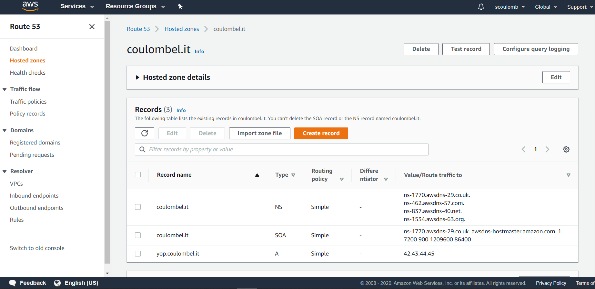
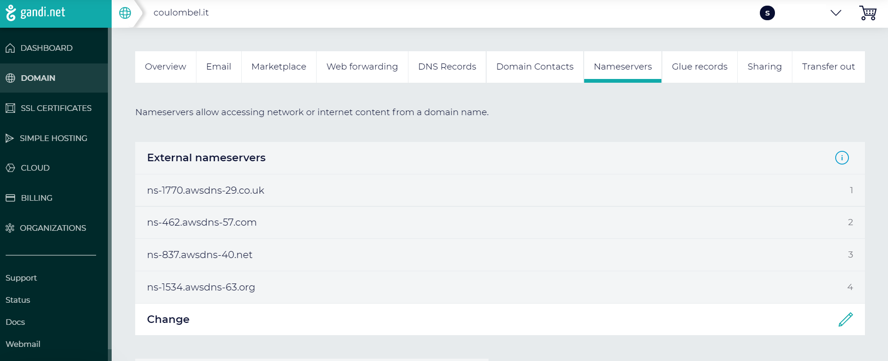
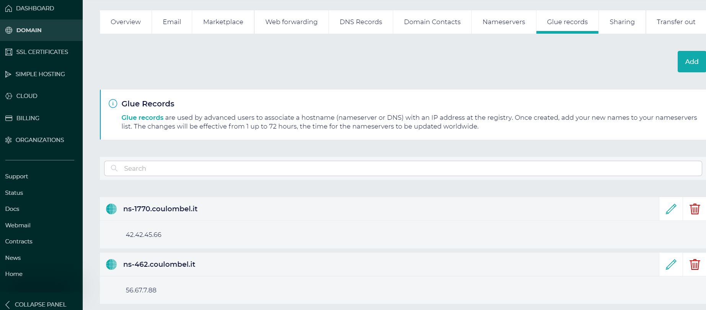

# Make your tld ns record point to a nameserver of your choice (AWS route 53)


## Introduction

Assume I have a DNS server on my local machine or running in Kubernetes.
If I define any record like `netflix.com`, `coulombel.it` and then do 

````shell script
nslookup coulombel.it ::1
nslookup netflix.com ::1
````

it will return the record, I have defined in my DNS server.

Even if I am not owner of the domain it does not matter.

But this record is not visible by anybody, except from the one targeting explicitly my DNS.

How to make a DNS record in my own DNS server visible to the world, with a recursion coming from the root server?

Which process makes the owner of the record, the only person allowed to define it publicly?

This is possible by modifying the NS record pointing to the nameserver of the domain in the tld (`it`, `com`...) DNS server.
This operation is offered by the registrar.

Actually Gandi is providing 2 services.
- Registrar
    - Registration to the nameserver in the top level domain: this is done with a NS record pointing to the DNS nameserver
    We say it is a registar. From https://www.nic.it/en/registrars (it cc tld)
    > The Registrar is an Internet service provider that has a contract with the Registry to manage the  .it and edu.it domains.
    - Possibility to create a glue record in top level domain
- And they offer a Default DNS nameserver (Gandi live DNS)

By default NS record in TLD points to Gandi Live DNS and no glue record (there is a glue record in `net` tld for gandi.net)

This is what was demoed in [real world resolution example](1-real-own-dns-resolution-example.md).

Thus it is possible to change this default DNS nameserver to the one of our choice!
Like the one running in:
- VM with bind9 
- in Minikube in VM 
- Cloud VM or Kubernetes (OpenShift online, EKS....).
- Or using DNS managed service like Amazon route 53.

Combined with:
- [DNS delegation and glue for google example](../4-bind-delegation/dns-delegation.md#Example-of-google-glue) 
- [real own DNS resolution example](1-real-own-dns-resolution-example.md) 
- [Glue definition](../4-bind-delegation/dns-delegation.md#My-glue-definition) 
<!-- Right. And those glue records are also provided by and via the registrar. => in the scope of question and describe in this file but can define glue everywhere -->

This answers this question perfectly:
https://serverfault.com/questions/1026417/how-top-level-domain-dns-server-is-aware-of-the-ip-address-of-the-domain-s-names/1026426#1026426

<!-- for the mistake I had copied that anyway
for comment addresses (hostnames) -> would say DNS name, or FQDN -->

As an exercise, as owner of `coulomnel.it` domain I will change the `NS` record of `coulombel.it` to point to Amazon route 53 nameserver rsather than Gandi Live DNS.

## Exercise

### Step 1: route 53 creation 

We go to route 53 console.
https://console.aws.amazon.com/route53/v2/hostedzones

We create a new hosted zone `coulombel.it`.
It contains following A record:
````shell script
yop.coulombel.it	A	Simple	-	42.43.44.45
````

Here is a screenshot of AWS console:



Once it is created we can see that this record is present in this 4 DNS nameserver:

````shell script
ns-1770.awsdns-29.co.uk.
ns-462.awsdns-57.com.
ns-837.awsdns-40.net.
ns-1534.awsdns-63.org.
````

If we do 

````shell script
nslookup yop.coulombel.it ns-462.awsdns-57.com
````


Output is

````shell script
➤ nslookup yop.coulombel.it ns-462.awsdns-57.com                                                                                                                              vagrant@archlinuxServer:         ns-462.awsdns-57.com
Address:        205.251.193.206#53

Name:   yop.coulombel.it
Address: 42.43.44.45
````

My record is resolved but it is actually like it is on my local machine.

If we do it using any recursive server which start recursion from root, it will target Gandi Live DNS which does not have the record.


<!--
Amazon UI is confusing in top left colum we should have a point at end of name (FQDN)
-->

### Step 2: change DNS glue record

For this I will change the `NS` record in `it` country code top level domain (tld) DNS server for `coulombel.it`.

In Gandi for to Nameserver sections, edit and choose external nameservers rather than Gandi Live DNS.
Modification takes some hours.

As a result we have:



And as result we can not define a record in Gandi (as it will be done in route 53):


### Step 3: show a lookup

First we can see authoritative nameserver for `coulombel.it` are now route 53 
Unlike `coulombel.site` where it is still Gandi Live DNS nameserver.

<details>
<summary>Click to expand..</summary>
<p>


````shell script

$ nslookup yop.coulombel.it ns-462.awsdns-57.com^C

scoulombel@NCEL96011 MINGW64 ~/dev/dev_vm (custom)
$ vagrant ssh
Last login: Mon Aug 17 08:27:17 2020 from 10.0.2.2
Welcome to fish, the friendly interactive shell
Type `help` for instructions on how to use fish
[09:17] ~
➤ nslookup yop.coulombel.it ns-462.awsdns-57.com                                                                                                                              vagrant@archlinuxServer:         ns-462.awsdns-57.com
Address:        205.251.193.206#53

Name:   yop.coulombel.it
Address: 42.43.44.45

[09:17] ~
➤ nslookup -type=ns coulombel.site                                                                                                                                            vagrant@archlinuxServer:         10.0.2.3
Address:        10.0.2.3#53

Non-authoritative answer:
coulombel.site  nameserver = ns-219-c.gandi.net.
coulombel.site  nameserver = ns-252-a.gandi.net.
coulombel.site  nameserver = ns-72-b.gandi.net.

Authoritative answers can be found from:

[09:48] ~
➤ nslookup -type=ns coulombel.it                                                                                                                                              vagrant@archlinuxServer:         10.0.2.3
Address:        10.0.2.3#53

Non-authoritative answer:
coulombel.it    nameserver = ns-1534.awsdns-63.org.
coulombel.it    nameserver = ns-1770.awsdns-29.co.uk.
coulombel.it    nameserver = ns-462.awsdns-57.com.
coulombel.it    nameserver = ns-837.awsdns-40.net.

Authoritative answers can be found from:
````
Note:
- This query resolution for `NS` type follows same path as in [real-world-resolution-example](1-real-own-dns-resolution-example.md))
- Changing DNS to route53 only change end of resolution (from step 3) which is similar 
- `nslookup -type=ns . 8.8.8.8` -> `f.root-servers.net.` / `nslookup -type=ns info 192.5.5.241` / `nslookup -type=ns org 192.5.5.241`: info and org are have their nameserver in both domain.

</p>
</details>


<!--
If to resolve `org` we hit an `org`, we need the glue, and if it an `info`, we need to resolve `info`, which needs the glue if info, and if org come back to departure point so need the glue.
Juge correct
--> 

And I can now query my record hosted in route 53.

````shell script
nslookup yop.coulombel.it 8.8.8.8
dig +trace yop.coulombel.it @8.8.8.8
````

Output is

<details>
<summary>Click to expand..</summary>
<p>

````shell script
[10:19] ~
➤ nslookup yop.coulombel.it 8.8.8.8                                                                                                                                           vagrant@archlinuxServer:         8.8.8.8
Address:        8.8.8.8#53

Non-authoritative answer:
Name:   yop.coulombel.it
Address: 42.43.44.45

[10:19] ~
➤ dig +trace yop.coulombel.it @8.8.8.8                                                                                                                                        vagrant@archlinux

; <<>> DiG 9.16.0 <<>> +trace yop.coulombel.it @8.8.8.8
;; global options: +cmd
.                       63127   IN      NS      a.root-servers.net.
.                       63127   IN      NS      b.root-servers.net.
.                       63127   IN      NS      c.root-servers.net.
.                       63127   IN      NS      d.root-servers.net.
.                       63127   IN      NS      e.root-servers.net.
.                       63127   IN      NS      f.root-servers.net.
.                       63127   IN      NS      g.root-servers.net.
.                       63127   IN      NS      h.root-servers.net.
.                       63127   IN      NS      i.root-servers.net.
.                       63127   IN      NS      j.root-servers.net.
.                       63127   IN      NS      k.root-servers.net.
.                       63127   IN      NS      l.root-servers.net.
.                       63127   IN      NS      m.root-servers.net.
.                       63127   IN      RRSIG   NS 8 0 518400 20200830170000 20200817160000 46594 . zyG2jY72otSsai43VvQb8jhX/kvBGfKE/deGJ3/rcU3bHeq/Ihk+2A+g EOlfP8Iqxqm2vD+9Oma09LnE684sKr65m7tHenreZgOGKwb563whaHYQ t/fbJVTEui08thrfTDrVxh6RjiiDezKRXfJ6VFnh/Bv+IgW1hfdaeVe0 yLrBfgjfOzsCHOdkNu55uXLjGdOdVun3QrHuwZTJKFCq2LWEMCMV3mFa 8J3F0ASfbXW1hor9nKkY1xhkuxCof/+a1MqwkUllpsxVuICcZnoUYtb+ UJre3uqoykKw/5O80k5YlS9sy2UF0d5ntZCKsYXq1NF2fKQdGujQ5EVi AzOKdA==
;; Received 525 bytes from 8.8.8.8#53(8.8.8.8) in 93 ms

it.                     172800  IN      NS      m.dns.it.
it.                     172800  IN      NS      nameserver.cnr.it.
it.                     172800  IN      NS      r.dns.it.
it.                     172800  IN      NS      a.dns.it.
it.                     172800  IN      NS      dns.nic.it.
it.                     172800  IN      NS      s.dns.it.
it.                     86400   IN      DS      41901 10 2 47F7F7BA21E48591F6172EED13E35B66B93AD9F2880FC9BADA64F68C E28EBB90
it.                     86400   IN      RRSIG   DS 8 1 86400 20200831050000 20200818040000 46594 . NmYCSPGYHta/M7oa8tU48Zuz931YMe+NF7WkCm/abUH8kBqj8v+0lZ/X lSYr3A/mFTwcPQaU7dE716qiceS5n649U+hMDiaYcRn+BMJp2qJ+t/+Z Nx14LCeWAGAUmzZc61D4jxaK80Fy+BKXyNvNO9CTwjyVvJVJSBZ/MpwJ 3BANuMvQ8lE76qoknxT1iZfHW3/rElSBFabwpdhBulxcY6co+t++T7Ef SGHMyXa8xngpf7bYoiE9eW91G38DIjb92F5lmUyzWEbC29kOtU/IxRak HT4MYFPPMdlYEbp3DxImkx+zUvgBjTSy4IixrpJrZNRykrrVo2s60Omu NRIb2Q==
;; Received 791 bytes from 192.112.36.4#53(g.root-servers.net) in 276 ms

coulombel.it.           10800   IN      NS      ns-837.awsdns-40.net.
coulombel.it.           10800   IN      NS      ns-1534.awsdns-63.org.
coulombel.it.           10800   IN      NS      ns-1770.awsdns-29.co.uk.
coulombel.it.           10800   IN      NS      ns-462.awsdns-57.com.
P47AIBGGO33PT097CC85OSPL750NKETD.it. 3600 IN NSEC3 1 1 10 EE67901FD4CC0D7E P48HSOGT5MCGT8QPQ4PJI7VMLGKF2LV9 NS SOA RRSIG DNSKEY NSEC3PARAM
P47AIBGGO33PT097CC85OSPL750NKETD.it. 3600 IN RRSIG NSEC3 10 2 3600 20200917090328 20200818090328 18395 it. GWuoYEoi6eLTOHcsIX3t1s5e1ra42DZYtaDLFfKYQuaC2LTuTC1oeEHd CyDrdXutJ6DjUaW80SQldjFdj6JHbi7pRBeFPO+YHKkVYoVcWcVkXiK+ sOFx8X/XKjtYnBsKlG/5MC/uTMStYP1m8aw14QBBiH60YMAD9acHGipQ aieFjIQVmQq+N5R9+crD0IrUjojX4MhtAx91T6YwVwhkQZCwIrvQXQQV O9mGa1jQR2IZoWc3wKYvMYwK4UF+ZW9vCx6eIo42YScbD3udrPH8w9Ps RhXiFCu4lWbPawOxW50iS/jNdD46U21mZ0QXQJCl+oiyOeQs60gYYCqh e07VYg==
QTFDL8AKT7ORT6HT7L87T6JGIJIGMQVV.it. 3600 IN NSEC3 1 1 10 EE67901FD4CC0D7E QTICAP1CNVT16H23GRR3H2S6O3902KAR NS DS RRSIG
QTFDL8AKT7ORT6HT7L87T6JGIJIGMQVV.it. 3600 IN RRSIG NSEC3 10 2 3600 20200917090328 20200818090328 18395 it. HlrUZ/+8gQyBGbclkzHNGa9JqkRes/cDWDDEE1Kr5rsqXUzV2FjY0Wai FdzY3IjbByLtP0M/iLK9Kod/MeSwX6Cm5P2kWxDueLz4pinemmYuhE5H 4RXj486OdwnCA4iOnu0wWBeLmoX2teyOrq1rtv+S34Oe5quPEQq6KAPb 65k+upHcQz/cPxrvCrGT5OEEjOR6x8/zhPKgH8wxTNfhvz+DbjwSXovT S1Pfr5pNU1M5di/wt9e5ccqApwTvDND5R8yeFaQd8Jat7e+aYEceIME6 aHRWy3k094xJLiDtVlspZp3uT5J6YdezTRSbVBpJkw8vHuU/5X8+zULB QlJEqA==
;; Received 968 bytes from 193.206.141.46#53(r.dns.it) in 83 ms

yop.coulombel.it.       300     IN      A       42.43.44.45
coulombel.it.           172800  IN      NS      ns-1534.awsdns-63.org.
coulombel.it.           172800  IN      NS      ns-1770.awsdns-29.co.uk.
coulombel.it.           172800  IN      NS      ns-462.awsdns-57.com.
coulombel.it.           172800  IN      NS      ns-837.awsdns-40.net.
;; Received 201 bytes from 205.251.197.254#53(ns-1534.awsdns-63.org) in 93 ms

[10:19] ~
➤                                                                                                                                                                             vagrant@archlinux
````

</p>
</details>

Documentation for this can be found:
- [Route 53](https://docs.aws.amazon.com/fr_fr/Route53/latest/DeveloperGuide/migrate-dns-domain-inactive.html)
- [Gandi](https://docs.gandi.net/fr/noms_domaine/operations_courantes/changer_serveur_de_nom.html)

### Glue in Gandi

It could have happened that my nameserver DNS would not be

````shell script
ns-1770.awsdns-29.co.uk.
ns-462.awsdns-57.com.
ns-837.awsdns-40.net.
ns-1534.awsdns-63.org.
````

But 

````shell script
ns-1770.coulombel.it.
ns-462.coulombel.it.
ns-837.coulombel.it.
ns-1534.coulombel.it.
````

In that case it would have been needed to create a glue record for those 4 DNS record in it cc tld DNS to point to our namserver.
Otherwise we would turn into circle [real-world-resolution-example](1-real-own-dns-resolution-example.md)) at step 3b.
With a glue record step 3b is straightforward (nameserver record is returned directly by it cc tld and there is no details as in step 5)

With Gandi it is possbile to create a glue record here:



It is documented in [Gandi doc](https://docs.gandi.net/en/domain_names/advanced_users/glue_records.html).

## About web forwarding

This was described here: https://github.com/scoulomb/github-page-helm-deployer/blob/master/appendix-github-page-and-dns.md#mutildomain

To make those redirection work:

- (1) http://coulombel.it	PERMANENT https://sylvain.coulombel.site		
- (2) http://sylvain.coulombel.it	PERMANENT https://scoulomb.github.io

Here in Gandi


We need to define those records in route 53

````shell script
@ 10800 IN A 217.70.184.38 # For (1)
sylvain 10800 IN CNAME webredir.vip.gandi.net. # For (2)
````
Where 

````shell script
[vagrant@archlinux myDNS]$ nslookup -type=ptr 217.70.184.38
Server:         10.0.2.3
Address:        10.0.2.3#53

Non-authoritative answer:
38.184.70.217.in-addr.arpa      name = webredir.vip.gandi.net.

Authoritative answers can be found from:
````

Here in route 53


The 2 worked (tested) with route 53 and as with Gandi they redirect to `sylvain.coulombel.site` (in forwarder we can use `scoulomb.github.io` or `sylvain.coulombel.site`).


### Links 

- https://jvns.ca/blog/how-updating-dns-works/
- https://howdns.works/ep7/

<!-- all clear even link with docker bind. yes -->
<!-- I switched to Gandi but no need to compare result as site is equivalent,
and sufficient for our comparison -->


### Note about reverse zone

We had configured reverse zone in [part 1](../../1-basic-bind-lxa/p2-2-configure-reverse-zone.md).
How to be authoritative for a reverse zone?:

https://www.apnic.net/manage-ip/manage-resources/reverse-dns/

It is not part of DNS offer but cloud:

https://docs.gandi.net/en/domain_names/faq/record_types/ptr_record.html

And it makes sense, mechanism is the same then as forward