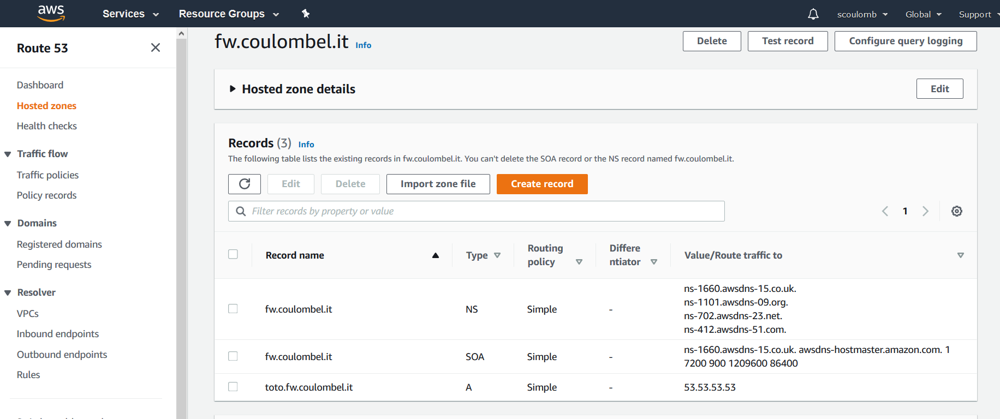

# Delegate a subdomain 

In [section 2](./2-modify-tld-ns-record.md), we changed the `NS` at top level domain to point to Amazon Route 53 DNS server rather than Gandi
Now we come back to the initial situal when top level domain server (IT) point to Gandi Live DNS server.
But we will delegate a Subdomain of `coulombel.site` to Amazon route 53 DNS server.

Objective is for Gandi DNS nameserver to delegate `xx.fw.coulombel.site` to Amazon route 53 DNS server.

## Step 1: Create Hosted zone in AWS 

We will start by creating `fw.coulombel.it` hosted zone in AWS.
And a A record `toto`.

So that we have

.

if we now do:

````shell script
nslookup toto.fw.coulombel.it ns-412.awsdns-51.com
nslookup toto.fw.coulombel.it 8.8.8.8
````


````shell script
➤ nslookup toto.fw.coulombel.it ns-412.awsdns-51.com                                                                                                                          vagrant@archlinuxServer:         ns-412.awsdns-51.com
Address:        205.251.193.156#53

Name:   toto.fw.coulombel.it
Address: 53.53.53.53

➤ nslookup toto.fw.coulombel.it 8.8.8.8                                                                                                                                       vagrant@archlinuxServer:         8.8.8.8
Address:        8.8.8.8#53

** server can't find toto.fw.coulombel.it: NXDOMAIN
````

To make it work from root server via recursive we need to configure the delegation.
This is what we will do.


## Step 2: Configure subdomain delegation in Gandi 

In AWS route 53, our nameservers are:

````shell script
ns-1660.awsdns-15.co.uk.
ns-1101.awsdns-09.org.
ns-702.awsdns-23.net.
ns-412.awsdns-51.com.
````

I will configure a 4 NS record, Gandi Live DNS nameservers to point to this DNS.

As such 

````shell script
fw 300 IN NS ns-1660.awsdns-15.co.uk.
fw 300 IN NS ns-1101.awsdns-09.org.
fw 300 IN NS ns-702.awsdns-23.net.
fw 300 IN NS ns-412.awsdns-51.com.
````

<!--
And not fw.coulombel.it without the dot
-->
As such if we now do 

````
nslookup toto.fw.coulombel.it 8.8.8.8
````

Output is 

````shell script
➤ nslookup toto.fw.coulombel.it 8.8.8.8                                     vagrant@archlinuxServer:         8.8.8.8
Address:        8.8.8.8#53

Non-authoritative answer:
Name:   toto.fw.coulombel.it
Address: 53.53.53.53
````

We can do dig to see it is delegated to route53.

````shell script
dig +trace toto.fw.coulombel.it @8.8.8.8       
````

````shell script
[16:13][NWAUTO-643-646-651-p2]✓ ~/dev/dns-automation
➤ dig +trace toto.fw.coulombel.it @8.8.8.8                                                                                                                                    vagrant@archlinux

; <<>> DiG 9.16.0 <<>> +trace toto.fw.coulombel.it @8.8.8.8
;; global options: +cmd
.                       23357   IN      NS      e.root-servers.net.
.                       23357   IN      NS      h.root-servers.net.
.                       23357   IN      NS      l.root-servers.net.
.                       23357   IN      NS      i.root-servers.net.
.                       23357   IN      NS      a.root-servers.net.
.                       23357   IN      NS      d.root-servers.net.
.                       23357   IN      NS      c.root-servers.net.
.                       23357   IN      NS      b.root-servers.net.
.                       23357   IN      NS      j.root-servers.net.
.                       23357   IN      NS      k.root-servers.net.
.                       23357   IN      NS      g.root-servers.net.
.                       23357   IN      NS      m.root-servers.net.
.                       23357   IN      NS      f.root-servers.net.
.                       23357   IN      RRSIG   NS 8 0 518400 20200830170000 20200817160000 46594 . zyG2jY72otSsai43VvQb8jhX/kvBGfKE/deGJ3/rcU3bHeq/Ihk+2A+g EOlfP8Iqxqm2vD+9Oma09LnE684sKr65m7tHenreZgOGKwb563whaHYQ t/fbJVTEui08thrfTDrVxh6RjiiDezKRXfJ6VFnh/Bv+IgW1hfdaeVe0 yLrBfgjfOzsCHOdkNu55uXLjGdOdVun3QrHuwZTJKFCq2LWEMCMV3mFa 8J3F0ASfbXW1hor9nKkY1xhkuxCof/+a1MqwkUllpsxVuICcZnoUYtb+ UJre3uqoykKw/5O80k5YlS9sy2UF0d5ntZCKsYXq1NF2fKQdGujQ5EVi AzOKdA==
;; Received 525 bytes from 8.8.8.8#53(8.8.8.8) in 43 ms

it.                     172800  IN      NS      r.dns.it.
it.                     172800  IN      NS      a.dns.it.
it.                     172800  IN      NS      nameserver.cnr.it.
it.                     172800  IN      NS      s.dns.it.
it.                     172800  IN      NS      m.dns.it.
it.                     172800  IN      NS      dns.nic.it.
it.                     86400   IN      DS      41901 10 2 47F7F7BA21E48591F6172EED13E35B66B93AD9F2880FC9BADA64F68C E28EBB90
it.                     86400   IN      RRSIG   DS 8 1 86400 20200831050000 20200818040000 46594 . NmYCSPGYHta/M7oa8tU48Zuz931YMe+NF7WkCm/abUH8kBqj8v+0lZ/X lSYr3A/mFTwcPQaU7dE716qiceS5n649U+hMDiaYcRn+BMJp2qJ+t/+Z Nx14LCeWAGAUmzZc61D4jxaK80Fy+BKXyNvNO9CTwjyVvJVJSBZ/MpwJ 3BANuMvQ8lE76qoknxT1iZfHW3/rElSBFabwpdhBulxcY6co+t++T7Ef SGHMyXa8xngpf7bYoiE9eW91G38DIjb92F5lmUyzWEbC29kOtU/IxRak HT4MYFPPMdlYEbp3DxImkx+zUvgBjTSy4IixrpJrZNRykrrVo2s60Omu NRIb2Q==
;; Received 795 bytes from 192.33.4.12#53(c.root-servers.net) in 50 ms

coulombel.it.           10800   IN      NS      ns-142-b.gandi.net.
coulombel.it.           10800   IN      NS      ns-142-c.gandi.net.
coulombel.it.           10800   IN      NS      ns-161-a.gandi.net.
67IFIVDR1147KAC6P2VP1ORCBO99HOU9.it. 3600 IN NSEC3 1 1 10 F2E5E0A62D20EB60 67K7C78BQ7OLI03V72K608SUAVR84803 NS SOA RRSIG DNSKEY NSEC3PARAM
67IFIVDR1147KAC6P2VP1ORCBO99HOU9.it. 3600 IN RRSIG NSEC3 10 2 3600 20200917150302 20200818150302 18395 it. FPepj7rZ//GFFgkV1KC+WBJasUFK32NgaQ8M8Pt5t9dO3B+aSI6Us74K 56oqT2dlq5+b6DpbGkeTSGdOcNT3HlyeNbDAuZFFKlOMz+5CKMausTGu mT8h+Zq7QvcsvYV+E0KbNZMFJOwfapQTCNJg/prXVCJFJJYkQEUGq022 QKN06i3aj+MRrk6bnD7T394V4AMmXLdtuKBTkl3frppzzoQ0SbcBGCmm j3I/nNQUUUDRawGtJ2uf4h8jGBhdExD36tBFVUtu7kAzzHqp3BGH1MTM D7Guzxfw2onh0D9uksFnFisTC1hYaoPRCDe67A2hvS5eLxSv/Kybf48s Zgt3fg==
HEM3AGR89RS8LPG6FIEOEUKAB06UI638.it. 3600 IN NSEC3 1 1 10 F2E5E0A62D20EB60 HEO3HV7P1PTH5TIQAS9RC0P6KCC05M5T NS DS RRSIG
HEM3AGR89RS8LPG6FIEOEUKAB06UI638.it. 3600 IN RRSIG NSEC3 10 2 3600 20200917150302 20200818150302 18395 it. NtXm17LV54hHPrDvYng9sBJXn3VGo7WScinI0qDY3v7BoxjqSd0XPr5A rMHruO/Y0iD/Djj53/kU/bsBeEKJXRtH9vwBcy3z4x/0c2kgz3dl7qlv 99K122MJ/pv0otGqss8o8RT+lu3Ar1o/eeNl4g/I7mJts/qf1Bsf/zs9 T2nLRSh/pT40PPUo1OFBwnu1MHSjPwrl1uEs1z84ROs86izH+VkPn7hn GrUTOkRJtHZpLI+3Sa+vMCzf1b8qkNasmU3NMugONavqWssf+J1aubVF arqDbtoPYPMPbckF8TxE5vyp3PCMXSK6+lLUtdDHrz8LnPDQiAEHnJxA 196LAw==
;; Received 910 bytes from 194.0.16.215#53(a.dns.it) in 50 ms

fw.coulombel.it.        300     IN      NS      ns-1660.awsdns-15.co.uk.
fw.coulombel.it.        300     IN      NS      ns-1101.awsdns-09.org.
fw.coulombel.it.        300     IN      NS      ns-702.awsdns-23.net.
fw.coulombel.it.        300     IN      NS      ns-412.awsdns-51.com.
;; Received 189 bytes from 217.70.187.143#53(ns-142-c.gandi.net) in 43 ms

toto.fw.coulombel.it.   300     IN      A       53.53.53.53
fw.coulombel.it.        172800  IN      NS      ns-1101.awsdns-09.org.
fw.coulombel.it.        172800  IN      NS      ns-1660.awsdns-15.co.uk.
fw.coulombel.it.        172800  IN      NS      ns-412.awsdns-51.com.
fw.coulombel.it.        172800  IN      NS      ns-702.awsdns-23.net.
;; Received 205 bytes from 205.251.194.190#53(ns-702.awsdns-23.net) in 50 ms
````

Last line `ns-702.awsdns-23.net` is the proof.

As in [tld](./2-modify-tld-ns-record.md#glue-in-gandi), we could have defined A record in the zone file. 

This page is doing something similar:

https://help.sendinblue.com/hc/fr/articles/208835929-Exemple-%C3%A9tape-1-pour-Gandi-D%C3%A9l%C3%A9gation-de-votre-sous-domaine

If we compare wih [section 2](./2-modify-tld-ns-record.md), we were going to route 53 directly whereas here we go through Gandi and then route 53.
So we are following this path [real-world-resolution-example](1-real-own-dns-resolution-example.md)), and at the end the path followed here [modify-tld-dns-record](./2-modify-tld-ns-record.md).
<!-- no need to detail more ok -->

<!-- 
NS delegation concluded
TOPIC Before ok 
Understand why TTL matters -okccl
Improve and conclude web forwarding - only propag effect remains - clearOKS

-->


