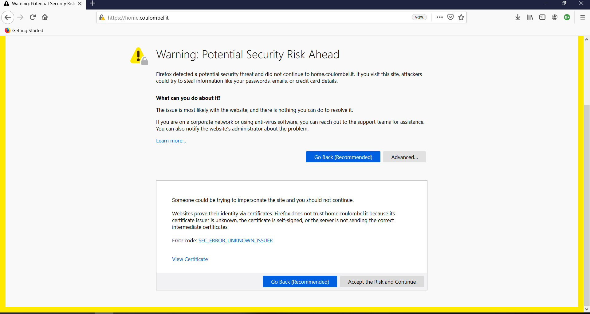
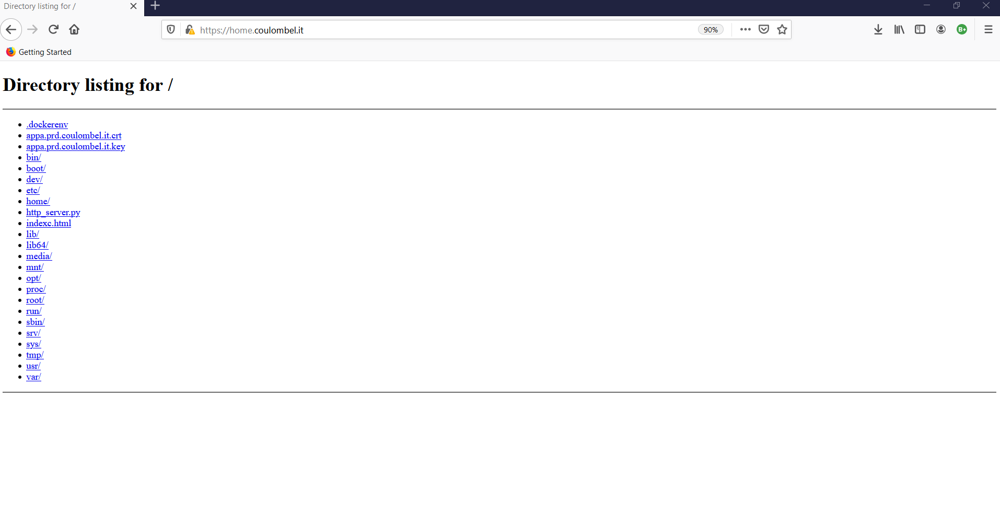

# Revisit part e and f with self-signed certificates

We will revisit:

- [section e, Show we can deploy application behind DNS via Docker and Kubernetes](6-use-linux-nameserver-part-e.md#show-we-can-deploy-application-behind-via-docker-and-kubernetes)
- [section f, Ingress](6-use-linux-nameserver-part-f.md)

Where we will expose the python server using HTTPS instead of HTTP. For this we need a certificate.
In this section we will use self-signed certificates.

## Step 0: Prerequisite

Start Minikube

````shell script
ssh sylvain@109.29.148.109
sudo minikube start --vm-driver=none
sudo su
````

And start own DNS nameserver from [part b](6-use-linux-nameserver-part-b.md).
We use following [script](./6-docker-bind-dns-use-linux-nameserver-rather-route53/6-use-linux-nameserver.sh). 

```shell script
./2-advanced-bind/5-real-own-dns-application/6-docker-bind-dns-use-linux-nameserver-rather-route53/6-use-linux-nameserver.sh
```

you can see [DNS entries](./6-docker-bind-dns-use-linux-nameserver-rather-route53/fwd.coulombel.it.db) we will use in this section.

## Step 1: How to generate a self-signed certificate

```shell-script
openssl req -newkey rsa:4096 -x509 -sha256 -days 365 -nodes -out appa.prd.coulombel.it.crt -keyout appa.prd.coulombel.it.key
```

- The [*.key](6-part-g-use-certificates/appa.prd.coulombel.it.key) file is the private key, and will only be known to the server itself.
- The [*.crt](6-part-g-use-certificates/appa.prd.coulombel.it.crt) file is the unsigned generated certificate of the FQDN itself (containing its public key).

## Step 2: Configure the server to use HTTPS

Rather than using the module: `python3 -m http.server 8080`.
We have to write a server file and provide the certificate.

The server can be found in that [location](6-part-g-use-certificates/http_server.py).

````shell script
cd ./2-advanced-bind/5-real-own-dns-application/6-part-g-use-certificates
python3 http_server.py
````

It is exposed on port 9443.
We can access via curl or browser on host machine via [localhost:9443](https://localhost:9443).
Be careful and mention https.

output is 

````shell script
sylvain@sylvain-hp:~$ curl https://localhost:9443
curl: (60) SSL certificate problem: self signed certificate
More details here: https://curl.haxx.se/docs/sslcerts.html

curl failed to verify the legitimacy of the server and therefore could not
establish a secure connection to it. To learn more about this situation and
how to fix it, please visit the web page mentioned above.
sylvain@sylvain-hp:~$ curl --insecure https://localhost:9443
<!DOCTYPE HTML PUBLIC "-//W3C//DTD HTML 4.01//EN" "http://www.w3.org/TR/html4/strict.dtd">
<html>
<head>
<meta http-equiv="Content-Type" content="text/html; charset=utf-8">
<title>Directory listing for /</title>
</head>
<body>
<h1>Directory listing for /</h1>
<hr>
<ul>
<li><a href="appa.prd.coulombel.it.crt">appa.prd.coulombel.it.crt</a></li>
<li><a href="appa.prd.coulombel.it.key">appa.prd.coulombel.it.key</a></li>
<li><a href="c.Dockerfile">c.Dockerfile</a></li>
<li><a href="http_server.py">http_server.py</a></li>
<li><a href="ingressv3.yaml">ingressv3.yaml</a></li>
<li><a href="README.md">README.md</a></li>
</ul>
<hr>
</body>
</html>
````

We can see the certificate is recognized but that it is self-signed.
There are 3 possibilities:
- Certificate is self-signed, so we have to add it manually or use `--insecure`
- Certificate is recognized by CA
- Certificate is recognized by CA but does not match the domain

We will configure reverse NAT as follows

````shell script
Nom  Protocole Type Ports externe IP de destination Ports de destination
9443 TCP       Port 9443          192.168.1.32      9443
````

So that it is visible on internet via [https://home.coulombel.it:9443](home.coulombel.it:9443) /  [109.29.148.109:9443](109.29.148.109:9443).

Open in a browser and check the certificate is correct (in left part of address bar).

## Step 3: Dockerize the server and run it via Docker

See [Dockerfile](6-part-g-use-certificates/c.Dockerfile).

````shell script
cd 2-advanced-bind/5-real-own-dns-application/6-part-g-use-certificates
sudo docker build . -f c.Dockerfile -t c-server
sudo docker rm test-c
sudo docker run -p 9443:9443 --rm --name test-c -it c-server 
````


**Traps**
1. `-p 9443:9443` should not be set at end of run command. Note we have NAT followed by Docker forwarding.
2. Inside [Python server file](6-part-g-use-certificates/http_server.py).) we should listen on all interface `0.0.0.0`.
Otherwise server inside Docker will not work. Note when deployed via Python directly it will work only when using `localhost`, if we wre using `localhost` instead of `0.0.0.0`.
It is not related to host headers.
3. Port 8443 can be used by k8s API server.

it would be similar with compose.

And test it via curl or browser [https://home.coulombel.it:9443](home.coulombel.it:9443) from a machine outside of the local network.

````shell script
➤ curl https://home.coulombel.it:9443
curl: (60) SSL certificate problem: self signed certificate
More details here: https://curl.haxx.se/docs/sslcerts.html

curl failed to verify the legitimacy of the server and therefore could not
establish a secure connection to it. To learn more about this situation and
how to fix it, please visit the web page mentioned above.

➤ curl -k https://home.coulombel.it:9443 | head -n 5
  % Total    % Received % Xferd  Average Speed   Time    Time     Time  Current
                                 Dload  Upload   Total   Spent    Left  Speed
100  1237  100  1237    0     0  24740      0 --:--:-- --:--:-- --:--:-- 24740
<!DOCTYPE HTML PUBLIC "-//W3C//DTD HTML 4.01//EN" "http://www.w3.org/TR/html4/strict.dtd">
<html>
<head>
<meta http-equiv="Content-Type" content="text/html; charset=utf-8">
<title>Directory listing for /</title>
````


## Step 4: Deploy in Kubernetes with NodePort

We will now deploy it using Kubernetes.

````shell script
kubectl delete pod c-server --force --grace-period=0 # imperative
kubectl run c-server --image=c-server --restart=Never --image-pull-policy=Never 

temp_file=$(sudo mktemp)
sudo chmod 777 ${temp_file}
sudo cat << FIN > ${temp_file}
apiVersion: v1
kind: Service
metadata:
  creationTimestamp: null
  labels:
    run: c-server
  name: cserver 
spec:
  ports:
  - port: 9443
    protocol: TCP
    targetPort: 9443
    nodePort: 31000
  selector:
    run: c-server
  type: NodePort
status:
  loadBalancer: {}
FIN
sudo cat ${temp_file}
sudo kubectl apply -f ${temp_file}
sudo rm $temp_file
````

Note `metadata.name`, does not support `-` in name. Error is not accurate (port error).
We can not use kubectl imperative expose command to specify the nodeport: `31000`

On the router reverse NAT we have following configuration

````shell script
NodePortRange	TCP	Plage	30000-32000	192.168.1.32	30000-32000
````
Matching subpart of valid ports range for k8s NodePort which is: 30000-32767.
<!-- to find allowed range for k8s Nodeport configure a node port outisde of range. Correct range will appear on error message -->

I kept range [32000, 32767], for case where we need to change port, between outside port and internal port.
For instance DNS on port `53` pointing to NodePort `32048`.

We can then access our server in browser at [https://home.coulombel.it:31000](https://home.coulombel.it:31000)

We could configure reverse NAT as follows

```shell script
NodePortRange	TCP	Plage	30000-32000	192.168.1.32	30000-32000	DISABLE	
443	TCP	Port	443	192.168.1.32	31000	ENABLE
```

And access on default https port: [https://home.coulombel.it](https://home.coulombel.it)

Output will be .

If we accept the risk

.

<!-- we can use cluster ip and co -->

## Step 5a : Deploy using Kubernetes ingress with HTTPS

We will use the ingress to perform host based routing with https.
We will enable ingress and redeploy application B.

````shell script
sudo minikube addons enable ingress

kubectl run b-server --image=b-server --restart=Never --image-pull-policy=Never 
# We need this to reuse the same port. We can use expose when we wat to specify NodePort
temp_file=$(sudo mktemp)
sudo chmod 777 ${temp_file}
sudo cat << FIN > ${temp_file}
apiVersion: v1
kind: Service
metadata:
  creationTimestamp: null
  labels:
    run: b-server
  name: b-server
spec:
  ports:
  - port: 80
    protocol: TCP
    targetPort: 8080
    nodePort: 30389
  selector:
    run: b-server
  type: NodePort
status:
  loadBalancer: {}
FIN
sudo cat ${temp_file}
sudo kubectl apply -f ${temp_file}
sudo rm $temp_file
````

And [configure ingress](6-part-g-use-certificates/ingressv3.yaml) so that:
-  `appa.prd.coulombel.it` routes to `c-server`.
-  `appb.prd.coulombel.it` routes to `b-server`.

```shell script
sudo kubectl apply -f 2-advanced-bind/5-real-own-dns-application/6-part-g-use-certificates/ingressv3.yaml
```

We have to configure NAT.
As the ingress router supports https and http.

- remove from previous section (otherwise will always target server-c) via the NodePort when using 443 and not got through the ingress: 

````shell script
443	TCP	Port	443	192.168.1.32	31000	ENABLE
````

- Add

````
80	TCP	Port	80	192.168.1.32	80   
443	TCP	Port	443	192.168.1.32	443
````

If we run following queries

````shell script
curl http://appa.prd.coulombel.it:80 # [1]
curl https://appa.prd.coulombel.it:443 # [2]
curl -k https://appa.prd.coulombel.it:443 # [3]

curl http://appb.prd.coulombel.it:80 # [4]
curl https://appb.prd.coulombel.it:443 # [5]
curl -k https://appb.prd.coulombel.it:443 # [6]
````

output is 

````shell script
root@sylvain-hp:/home/sylvain/myDNS_hp# curl http://appa.prd.coulombel.it:80
<html>
<head><title>502 Bad Gateway</title></head>
<body>
<center><h1>502 Bad Gateway</h1></center>
<hr><center>nginx/1.17.10</center>
</body>
</html>
root@sylvain-hp:/home/sylvain/myDNS_hp# curl https://appa.prd.coulombel.it:443
curl: (60) SSL certificate problem: unable to get local issuer certificate
More details here: https://curl.haxx.se/docs/sslcerts.html

curl failed to verify the legitimacy of the server and therefore could not
establish a secure connection to it. To learn more about this situation and
how to fix it, please visit the web page mentioned above.
root@sylvain-hp:/home/sylvain/myDNS_hp# curl -k https://appa.prd.coulombel.it:443
<html>
<head><title>502 Bad Gateway</title></head>
<body>
<center><h1>502 Bad Gateway</h1></center>
<hr><center>nginx/1.17.10</center>
</body>
</html>
root@sylvain-hp:/home/sylvain/myDNS_hp# curl http://appb.prd.coulombel.it:80
Hello app B
root@sylvain-hp:/home/sylvain/myDNS_hp# curl https://appb.prd.coulombel.it:443
curl: (60) SSL certificate problem: unable to get local issuer certificate
More details here: https://curl.haxx.se/docs/sslcerts.html

curl failed to verify the legitimacy of the server and therefore could not
establish a secure connection to it. To learn more about this situation and
how to fix it, please visit the web page mentioned above.
root@sylvain-hp:/home/sylvain/myDNS_hp# curl -k https://appb.prd.coulombel.it:443
Hello app B
root@sylvain-hp:/home/sylvain/myDNS_hp#
````

Analysis:
- From [6], we can see that kubernetes adds its own self-signed certificate.
Opening [6] in browser enables to see: `Kubernetes Ingress Controller Fake Certificate`.
- Same applies for [2] the `Kubernetes Ingress Controller Fake Certificate`.`, except that as there is another certificate behind and it does not work.

## Step 5b : Deploy using Kubernetes ingress with HTTPS and fix case [2]


Rather than having the certificate on the Python server we will have the certificate on the Ingress!

This is documented here:
- https://kubernetes.io/docs/concepts/services-networking/ingress/#tls
- https://kubernetes.io/docs/concepts/configuration/secret/#tls-secrets

Thus we do

````shell script
sudo kubectl delete secret tls-secret
sudo kubectl create secret tls tls-secret\
 --cert=./2-advanced-bind/5-real-own-dns-application/6-part-g-use-certificates/appa.prd.coulombel.it.crt\
 --key=./2-advanced-bind/5-real-own-dns-application/6-part-g-use-certificates/appa.prd.coulombel.it.key
sudo kubectl get secret/tls-secret -o yaml
````

And modify [our ingress]( [configure ingress](6-part-g-use-certificates/ingressv4.yaml) to use self-signed certificate in secret:

```shell script
sudo kubectl apply -f 2-advanced-bind/5-real-own-dns-application/6-part-g-use-certificates/ingressv4.yaml
```

If we browse to `https://appa.prd.coulombel.it/`, we do NOT have `Kubernetes Ingress Controller Fake Certificate` anymore but our own certificate.
But we still have a 502. We should not have have the SSL at application layer.

So we will modify our ingress v4 to [ingress v5](6-part-g-use-certificates/ingressv5.yaml) and reuse original application A.

```shell script
cd ./2-advanced-bind/5-real-own-dns-application/6-part-e-contenarized-http-server
sudo docker build . -f a.Dockerfile -t a-server
# we rebuild the image as tag could be overriden by a version using https, to check this kubectl exec -it server-a --bash; ps -aux
kubectl delete po a-server --force --grace-period=0
kubectl run a-server --image=a-server --restart=Never --image-pull-policy=Never 

# We need this to reuse the same port. We can use expose when we wat to specify NodePort
temp_file=$(sudo mktemp)
sudo chmod 777 ${temp_file}
sudo cat << FIN > ${temp_file}
apiVersion: v1
kind: Service
metadata:
  creationTimestamp: null
  labels:
    run: a-server
  name: a-server
spec:
  ports:
  - port: 80
    protocol: TCP
    targetPort: 8080
    nodePort: 30389
  selector:
    run: a-server
  type: NodePort
status:
  loadBalancer: {}
FIN
sudo cat ${temp_file}
sudo kubectl apply -f ${temp_file}
sudo rm $temp_file


sudo kubectl apply -f 2-advanced-bind/5-real-own-dns-application/6-part-g-use-certificates/ingressv5.yaml
```

And we now have a self signed certificate:

````shell script
root@sylvain-hp:~# curl https://appa.prd.coulombel.it/
curl: (60) SSL certificate problem: self signed certificate
More details here: https://curl.haxx.se/docs/sslcerts.html

curl failed to verify the legitimacy of the server and therefore could not
establish a secure connection to it. To learn more about this situation and
how to fix it, please visit the web page mentioned above.
root@sylvain-hp:~# curl -k https://appa.prd.coulombel.it/
Hello app A
````

In a browser (or using openssl) the certificate is not `Kubernetes Ingress Controller Fake Certificate`, but our certificate.
Deleting the secret has for impact to go back to `Kubernetes Ingress Controller Fake Certificate`.


Note: firefox considers that localhost is always valid. Github has an amazing feature to detect we pushed cert to repo. 

````shell script
GitGuardian has detected the following Generic Private Key exposed within your GitHub account.
````

In next [section](6-use-linux-nameserver-part-h.md) we will see how to have a certificate signed by an authority (not self signed).