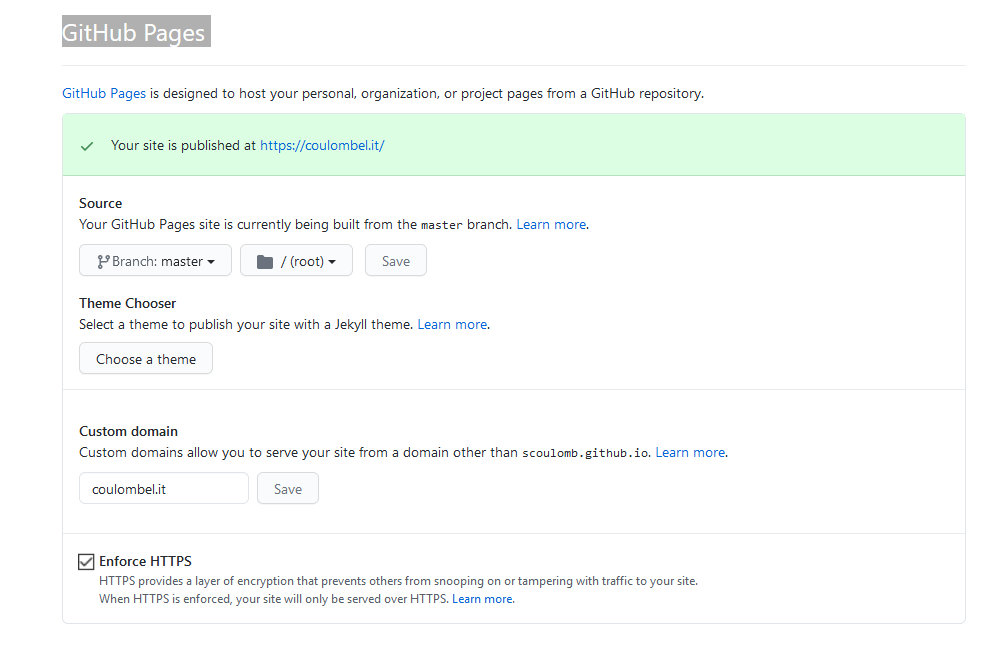

# Note on coulombel.it on github page

## Reminder

The repo can be found here:
https://github.com/scoulomb/dev_resume

And from readme instruction it is published here:
https://github.com/scoulomb/scoulomb.github.io

We could have made a CI/CD like here: https://github.com/scoulomb/github-page-helm-deployer
But the template we use has some issue with Docker.

We can use it via scoulmb.github.io as explained here: https://github.com/scoulomb/github-page-helm-deployer
But can define a custom DNS as explained here: https://github.com/scoulomb/github-page-helm-deployer/blob/master/appendix-github-page-and-dns.md
Then we have a CNAME file for name mapping.

Output is this DNS configuration: https://github.com/scoulomb/dns-config

##  We can also replace Gandi DNS server
 
Gandi config is given here: https://github.com/scoulomb/dns-config/blob/600fd4bc7aa1df272f9f5f68b6e279ff5f8208dc/it/fwd.coulombel.it.db#L28

We can replace Gandi by our DNS server:


````shell script
ssh sylvain@109.29.148.109
cd /path/to/repo
sudo minikube start --vm-driver=none
sudo su
````

And start own DNS nameserver from [part b](6-use-linux-nameserver-part-b.md).
We use following [script](./6-docker-bind-dns-use-linux-nameserver-rather-route53/6-use-linux-nameserver.sh). 

```shell script
./2-advanced-bind/5-real-own-dns-application/6-docker-bind-dns-use-linux-nameserver-rather-route53/6-use-linux-nameserver.sh
```

Where you can see [DNS entries](./6-docker-bind-dns-use-linux-nameserver-rather-route53/fwd.coulombel.it.db) 

````shell script
;; GITHUB page
@	             IN      A  	 185.199.108.153
@	             IN      A		 185.199.109.153
@	             IN      A       185.199.110.153
@	             IN      A		 185.199.111.153
````

Open browser to https://coulombel.it/. (checked 19 dec 2020)
We can see it is working and that certificate is let's encrypt 
<!-- use device were not cert mim -->

## Link 
Note the link with [part f analysis](6-use-linux-nameserver-part-f.md#analysis).

And [part h parallel](6-use-linux-nameserver-part-h.md#parallel).
As GCR we have apex (A) and non apex (CNAME). 

GCR, k8s ingress, and Openshift routes (we create 2 routes) can map several domain and github only one: 
https://stackoverflow.com/questions/16454088/can-github-pages-cname-file-contain-more-than-one-domain

## CNAME github file

Updating CNAME file: https://github.com/scoulomb/scoulomb.github.io/blob/master/CNAME
will impact the configuration here: https://github.com/scoulomb/scoulomb.github.io/settings

We could actually push it directly (as README welcome page).

Behind it generates CNAME mapping but also the certificate.
<!-- proof coulombel.site started certif process -->

Certificate generation was described in [part h, search for ](6-use-linux-nameserver-part-h.md#step-1-how-to-generate-a-certificate-signed-by-ca) 
> "Github page falls into that [category](https://community.letsencrypt.org/t/web-hosting-who-support-lets-encrypt/6920)"

<!-- all above is ok -->

## Details on HTTP and HTTPS

In [part H, parallel](6-use-linux-nameserver-part-h.md#parallel), we had made parallel between Ingress and Kubernetes.
We had seen in in [part H, extended tests](6-use-linux-nameserver-part-h.md#extended-test), redirection from `http` to `https`.

Github has a similar feature to enforce https.

Here in https://github.com/scoulomb/scoulomb.github.io/settings.
In section GitHub Pages.



We can tick enforce https. In that case there will be a redirection.
See  [GH doc](https://docs.github.com/en/github/working-with-github-pages/securing-your-github-pages-site-with-https#enforcing-https-for-your-github-pages-site).

Following queries

````shell script
curl http://coulombel.it -v | head -n 5
curl -L http://coulombel.it -v | head -n 5 # to follow redirection in Location header
curl https://coulombel.it -v | head -n 5
````

will have for output

````shell script
➤ curl http://coulombel.it -v | head -n 5
[...]
> GET / HTTP/1.1
> Host: coulombel.it
> User-Agent: curl/7.74.0
> Accept: */*
>
* Mark bundle as not supporting multiuse
< HTTP/1.1 301 Moved Permanently
< Content-Type: text/html
< Server: GitHub.com
< Location: https://coulombel.it/
[...]
<
{ [162 bytes data]
100   162  100   162    0     0     77      0  0:00:02  0:00:02 --:--:--    77
* Connection #0 to host coulombel.it left intact
<html>
<head><title>301 Moved Permanently</title></head>
<body>
<center><h1>301 Moved Permanently</h1></center>
<hr><center>nginx</center>

➤ curl -L http://coulombel.it -v | head -n 5 # to follow redirection in Location header and using protocol https default port 443
[...]
* Connected to coulombel.it (185.199.110.153) port 80 (#0)
> GET / HTTP/1.1
> Host: coulombel.it
> User-Agent: curl/7.74.0
> Accept: */*
>
* Mark bundle as not supporting multiuse
< HTTP/1.1 301 Moved Permanently
< Content-Type: text/html
< Server: GitHub.com
< Location: https://coulombel.it/
[...]
* Ignoring the response-body
[...]
*  subject: CN=coulombel.it
[...]
*  subjectAltName: host "coulombel.it" matched cert's "coulombel.it"
[...]
> GET / HTTP/1.1
> Host: coulombel.it
[...]
<!DOCTYPE html>
<html lang="en">

    <head>
        <meta charset="utf-8" />
[...]

➤ curl https://coulombel.it -v | head -n 5
[...]
<
<!DOCTYPE html>
<html lang="en">

    <head>
        <meta charset="utf-8" />
[...]
````

See doc on location header: https://developer.mozilla.org/fr/docs/Web/HTTP/Headers/Location

We use protocol default port 443 nut could use custom port:
https://stackoverflow.com/questions/27191946/redirect-to-another-site-with-not-standard-port-ipport

If I untick the box and wait a while

````shell script
curl http://coulombel.it -v | head -n 5
curl https://coulombel.it -v | head -n 5
````

output is 

````shell script
➤ curl http://coulombel.it | head -n 5
[...]
<html lang="en">

    <head>
        <meta charset="utf-8" />
 14 61181   14  8755    0     0  72958      0 --:--:-- --:--:-- --:--:-- 72958
curl: (23) Failure writing output to destination
[20:56] ~
➤ curl https://coulombel.it | head -n 5
[...]
<html lang="en">

    <head>
        <meta charset="utf-8" />
 23 61181   23 14427    0     0  36897      0  0:00:01 --:--:--  0:00:01 36897
curl: (23) Failure writing output to destination
````

Redirection is not enforced and some plugin could say it is insecure but it does not mean we do not offer https.

When we untick the box it did not have a direct effect
https://github.community/t/the-enforce-https-button-isnt-working/10429/2

To force it I updated the custom domain to `fake.it` and set back to `coulombel.it` to upate the CNAME file (commit).
It did not reprovision the cert and works instantly.

F5 load balancer also offers a similar feature:
https://clouddocs.f5.com/api/irules/HTTP__redirect.html.
If we want both http/https we would define 2 virtual server, on vs with 80 and the other 443 and link to the same pool.

## Use Gandi live DNS

For domain `coulombel.it`, we use our own nameserver.
To set back to Gandi live DNS.
Go to Gandi, select domain, choose domain, nameserver tab and edit.
And configure records: https://github.com/scoulomb/dns-config/blob/master/it/fwd.coulombel.it.db

(be aware of [negative TTL](../6-cache/negative-ttl.md) if record were not present)

<!-- can see dns corp is different -->


