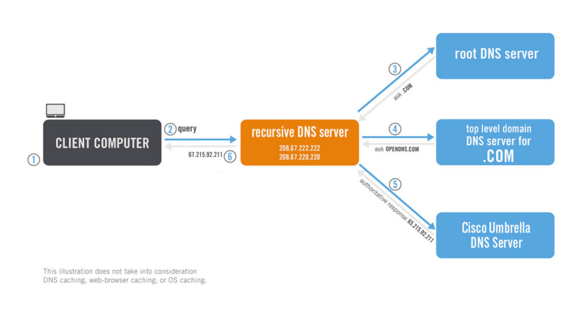

# Real world application

## Wrap-up


In this [document in basic part](../../1-basic-bind-lxa/p2-1-zz-note-on-recursive-and-authoritative-dns.md), we had this resolution schema.


We have seen in our experience

- [**recursive DNS**](../1-bind-in-docker-and-kubernetes/3-deploy-named-in-a-pod.md) : here it is the orange box
- [**Authoritative DNS**](../1-bind-in-docker-and-kubernetes/3-deploy-named-in-a-pod.md): here it is the bottom blue box (while other bluebox are authoritative for upper domain)
- [**Forwarding DNS**](../3-bind-forwarders/dns-forwarding.md) : here it is where an orange blue box would forward to another orange blue box
- [**Record delegation**](../4-bind-delegation/dns-delegation.md): blue box delegation to another blue box (path root -> com -> cisco)

## A real world resolution example

In Gandi DNS under `coulombel.site`, I will define A record:

````shell script
test 300 IN A 123.123.123.123
````

If I query it

````shell script
➤ nslookup test.coulombel.site 8.8.8.8                                                                                                                                        vagrant@archlinuxServer:         8.8.8.8
Address:        8.8.8.8#53

Non-authoritative answer:
Name:   test.coulombel.site
Address: 123.123.123.123

➤ dig test.coulombel.site @8.8.8.8 +trace                                                                                                                                     vagrant@archlinux

; <<>> DiG 9.16.0 <<>> test.coulombel.site @8.8.8.8 +trace
;; global options: +cmd
.                       25682   IN      NS      a.root-servers.net.
.                       25682   IN      NS      b.root-servers.net.
.                       25682   IN      NS      c.root-servers.net.
.                       25682   IN      NS      d.root-servers.net.
.                       25682   IN      NS      e.root-servers.net.
.                       25682   IN      NS      f.root-servers.net.
.                       25682   IN      NS      g.root-servers.net.
.                       25682   IN      NS      h.root-servers.net.
.                       25682   IN      NS      i.root-servers.net.
.                       25682   IN      NS      j.root-servers.net.
.                       25682   IN      NS      k.root-servers.net.
.                       25682   IN      NS      l.root-servers.net.
.                       25682   IN      NS      m.root-servers.net.
.                       25682   IN      RRSIG   NS 8 0 518400 20200829170000 20200816160000 46594 . MD3v/DLSw7ldmW2QmtwIXjZ9UKHqsAVIPa+N7j/qEUB9WVy31in9GflJ W64je0o8dr5LVaMdSDb6OZZ5iwOLmdNjON5j4ULI70yFsvxfW8ys2L6l pKm3hnt/43R+w5kGUo2TnZgyFvZSt1Y/RYwgviRB69Co+EbV9Klqjl/G S439weBUxQNLO5IGyaWHf/0HDE2apIcyOOskJJR2FFGEcwRWBf8yMTio BQkveOlun3kw+7/gu58I+XFf7Cgkl3vqkkX94vWM1b9GPBBspolf4U3s cfZEVmv3egz4lYZ9D6hjmD20X0aurpd7H5Q7Qb1JYYzuGYe2u2bXac0F OSnH8Q==
;; Received 525 bytes from 8.8.8.8#53(8.8.8.8) in 36 ms

site.                   172800  IN      NS      a.nic.site.
site.                   172800  IN      NS      b.nic.site.
site.                   172800  IN      NS      c.nic.site.
site.                   172800  IN      NS      d.nic.site.
site.                   86400   IN      DS      51676 8 1 90DDBEEEB973B0F8719ED763FB6EEDE97C73ABF5
site.                   86400   IN      DS      51676 8 2 883175F6F5C68EA81563B62D1B2B79B6A997D60DC6E20CC70AFD0CD6 B7E82F62
site.                   86400   IN      RRSIG   DS 8 1 86400 20200830050000 20200817040000 46594 . s0iTSnk0m+tJWKOOR+X001nnZZhIUGNfY0lkQEGZjBIc4ZIxJoWdVpO5 M0wCkeGVv7vc+256nYsljPSmaVD2fv57N7l6esfZaBMHoY3ZoAqxMaZC N1RugqDVsOXTrGYqJ6xe4re2n0jl7hBl0Tp5iC7yEuTbaFYsK3nBbYUS Fj3w9gORv2yk/5fgRvEZrcxvUWDHF1BNckPvJttBhFxnEIzO33D37jb1 ie1rVzWS/oIRbGHPBb+5EQN/sG17bgJqeHwJ0XJ8PChBHQnmJJ979JW4 7Ch2rkDD28ZBYzyytkmMX7Zj6sqOHUp9mvONInkC4BEdCUpD9jU4M268 /svXYg==
;; Received 663 bytes from 192.5.5.241#53(f.root-servers.net) in 46 ms

coulombel.site.         3600    IN      NS      ns-72-b.gandi.net.
coulombel.site.         3600    IN      NS      ns-219-c.gandi.net.
coulombel.site.         3600    IN      NS      ns-252-a.gandi.net.
dc7qjc1dvd5sfqovl8iihrqd1scolsuv.site. 3600 IN NSEC3 1 1 1 - DCCIGQH6728HURPRR9VVJI9I046L4U33 NS SOA RRSIG DNSKEY NSEC3PARAM
hvkkgjn7bg5es5p9eh3t7vav6ug8dkf4.site. 3600 IN NSEC3 1 1 1 - I0B80IKSFLVGUCDIPPNSJBO83HKFP50T NS DS RRSIG
dc7qjc1dvd5sfqovl8iihrqd1scolsuv.site. 3600 IN RRSIG NSEC3 8 2 3600 20200830223902 20200731230926 5010 site. MjquaMm6MErKeFiA1RQnowkDIkG1rW0hgvMXoimg/Tctevc6BgRQAXxr HofNErhLRv+U+z2zpGsooTztETWDr1krcYPitWspqEByg3VEnvykhTa8 DycQfG9Ik7kNITUhh4cyaf/8jnUUJTsRLGyslCaoHdPzCAV/KrTlOn7R Np4=
hvkkgjn7bg5es5p9eh3t7vav6ug8dkf4.site. 3600 IN RRSIG NSEC3 8 2 3600 20200915102248 20200816170725 13365 site. Ek9LbNjIwA9IyOynRxOcR8F/ZlltupZeG+t8Q6n6XUyiGJfFGqEMx+go K3cmZT9R5C38cwXrtlWuMx1CpH94mJ/LOD4LwNiYG3Xkw8j/mZkJpJBQ v0Gq5aSxU56EFD5VTYQIhTOSnaHb+MnLz44fhhLE5oTWq5zN5KD7O4WP N7U=
;; Received 612 bytes from 185.24.64.61#53(b.nic.site) in 60 ms

test.coulombel.site.    300     IN      A       123.123.123.123
;; Received 64 bytes from 173.246.100.253#53(ns-252-a.gandi.net) in 40 ms
````

The resolution process will be:

1. The recursive DNS has an hardcode of the 12 root servers.
    - `nslookup -type=ns . 8.8.8.8` -> `f.root-servers.net.`.
    - `nslookup -type=A  f.root-servers.net 8.8.8.8` -> `192.5.5.241`.

2. The recursive DNS queries one of the DNS root nameserver (`.`) 
The root server then responds to the resolver with the hostname (in the `NS` record) of Top Level Domain (TLD) DNS server (site) 
    - `nslookup -type=ns site 192.5.5.241` -> `b.nic.site.`
    -  `b.nic.site.` ->  `185.24.64.61`    
        - The name server `b.nic.site.` is hosted at the same domain as the domain name itself (`test.coulombel.site`).
        - The query would loop again `nslookup -type=ns site 192.5.5.241`, but actually there is a glue record.
        - It is visible in additional section `dig site @192.5.5.241 +norecurse` (but not returned by a nslookup at root).

3. The resolver then makes a request to the `.site` TLD.
    - `nslookup -type=ns coulombel.site 185.24.64.61` -> `ns-252-a.gandi.net.`.
        - a. The TLD server then responds with the hostname (NS record) of the domain’s nameserver for `coulombel.site` which is,  `ns-252-a.gandi.net.`.
        - b. At that time `nslookup -type=A ns-252-a.gandi.net 8.8.8.8` -> `173.246.100.253` is resolved.

4. The recursive resolver sends a query to the domain’s nameserver.
    -`nslookup -type=ns test.coulombel.site 173.246.100.253` -> Nothing, no delegation
    - `nslookup -type=A test.coulombel.site 173.246.100.253` -> `123.123.123.123`
    - The IP address for `sylvain.coulombel.site` (or `coulombel.site`) is then returned to the resolver from the nameserver.

5. Step 3b details: (`nslookup -type=A ns-252-a.gandi.net 8.8.8.8` -> `173.246.100.253` is resolved.).

    ````shell script
    [root@archlinux docker-bind-dns-it-cc-tld]# dig ns-252-a.gandi.net  +trace @8.8.8.8
    
    ; <<>> DiG 9.16.0 <<>> ns-252-a.gandi.net +trace @8.8.8.8
    ;; global options: +cmd
    .                       56752   IN      NS      c.root-servers.net.
    .                       56752   IN      NS      j.root-servers.net.
    .                       56752   IN      NS      l.root-servers.net.
    .                       56752   IN      NS      g.root-servers.net.
    .                       56752   IN      NS      a.root-servers.net.
    .                       56752   IN      NS      h.root-servers.net.
    .                       56752   IN      NS      k.root-servers.net.
    .                       56752   IN      NS      m.root-servers.net.
    .                       56752   IN      NS      f.root-servers.net.
    .                       56752   IN      NS      e.root-servers.net.
    .                       56752   IN      NS      i.root-servers.net.
    .                       56752   IN      NS      d.root-servers.net.
    .                       56752   IN      NS      b.root-servers.net.
    .                       56752   IN      RRSIG   NS 8 0 518400 20200830050000 20200817040000 46594 . blP/N8E4AMHi8sq632nJsVzJf68ePjN9xfK0Vbg0qwBem9aEbEHkP6nw U1ntBtSzxbHp78fjTzKICYjr7cADfOYy6IbDd77w2dps6/E9eZegmCbS 3sP9jDrm4ryLScdgNPefEHBdEFsMt+94slM88JXCdQa8A+qDoOpMgrgY jj0QePlAnqacFzPf+ZsdBOKv1kWRmhlMOQheTGqJ2Nswl65zZ0sQ3hVG 7qL/o6/Y3lA0GehpjG4wkrugS3xh3EycmP/FephMmRnA9xVGlovqebGf T24b1lVRhel+1KsutfnjZd3VeL0EFDg2vbuvtmpAddSIMn8l3PCfcom1 3VE0Nw==
    ;; Received 525 bytes from 8.8.8.8#53(8.8.8.8) in 53 ms
    
    net.                    172800  IN      NS      l.gtld-servers.net.
    net.                    172800  IN      NS      d.gtld-servers.net.
    net.                    172800  IN      NS      i.gtld-servers.net.
    net.                    172800  IN      NS      h.gtld-servers.net.
    net.                    172800  IN      NS      f.gtld-servers.net.
    net.                    172800  IN      NS      k.gtld-servers.net.
    net.                    172800  IN      NS      c.gtld-servers.net.
    net.                    172800  IN      NS      e.gtld-servers.net.
    net.                    172800  IN      NS      m.gtld-servers.net.
    net.                    172800  IN      NS      j.gtld-servers.net.
    net.                    172800  IN      NS      g.gtld-servers.net.
    net.                    172800  IN      NS      b.gtld-servers.net.
    net.                    172800  IN      NS      a.gtld-servers.net.
    net.                    86400   IN      DS      35886 8 2 7862B27F5F516EBE19680444D4CE5E762981931842C465F00236401D 8BD973EE
    net.                    86400   IN      RRSIG   DS 8 1 86400 20200830050000 20200817040000 46594 . rNe9idJol+Ff4rqOKpmPqa0Urw331J/4qyfek/VXLotPsfk+o7pTLyZJ R3sE6gLhcDxTuRhuFkLkJj4CQX+9ijgMoZmIFTdJsk4Vye7GTezL9DX1 DLySyUQW2FvyWRO03S3wFFAT7XisWAyrJLtVnxutjOf7xQvhF4YdYF/6 RX+SDO4l+UNgN1GbXGjLi0aAGZsAfngKpo/2DCg1tNzLwoq6RffOqm6z z0luzzSte+HxStSulj6tVNlYz+sdprLd6BHe4RL1W+Y9P6l/aSGYpTei ERNXmpK+w3u4rUzr330ZkdxT48wwN9rIKJRD0rLToaX8uwhy7PqXmNKa T3NMpg==
    ;; Received 1175 bytes from 192.36.148.17#53(i.root-servers.net) in 60 ms
    
    gandi.net.              172800  IN      NS      dns0.gandi.net.
    gandi.net.              172800  IN      NS      dns1.gandi.net.
    gandi.net.              172800  IN      NS      dns2.gandi.net.
    gandi.net.              172800  IN      NS      dns3.gandi.net.
    gandi.net.              172800  IN      NS      dns6.gandi.net.
    gandi.net.              172800  IN      NS      dns4.gandi.net.
    A1RT98BS5QGC9NFI51S9HCI47ULJG6JH.net. 86400 IN NSEC3 1 1 0 - A1RUUFFJKCT2Q54P78F8EJGJ8JBK7I8B NS SOA RRSIG DNSKEY NSEC3PARAM
    A1RT98BS5QGC9NFI51S9HCI47ULJG6JH.net. 86400 IN RRSIG NSEC3 8 2 86400 20200821065218 20200814054218 56519 net. XatU7IXGyJjPUZiU48aUMa1baaPyIhVJhmsWTdj9SwLBy28WbiT7xF8R rJEOTEKSVeoT32rt1PXhMV3JfLgtlMJpIwF0axUb+pJLVXyotiQJwWUA V2UhanhUCBHpKbMnnoH1BwL4A3yNLoCN3GyXuQKmJPhCeWVCt1WBfOiK AzdiE05RAvs9bKsp9BYKh5PrhkJ2rynkZ2RWoAudguEQfA==
    J8LLN00IOU8GGFGNET44I5QVDQQ3G2K4.net. 86400 IN NSEC3 1 1 0 - J8LNMUTBEHTNODLF50D03MEUA0IJNH9C NS DS RRSIG
    J8LLN00IOU8GGFGNET44I5QVDQQ3G2K4.net. 86400 IN RRSIG NSEC3 8 2 86400 20200822065104 20200815054104 56519 net. yq8yyIj/Sy/nrZkEMnkoFMsGS0FAxg5DtBNIVuP+R4oy6ibh+RULYl7P mKw/w7oA2VUUcC195gh4aHT6dDRFYBxpKfXUWyyLN2QFnmBtKHTrdwYH CMh4to5EwTKp8biG/ctyMNo/LgjfK1TZA1PWTk/NKjrXLSFd2qgHGXks 0f/9Y4aRJ9EcEDzC062tVsyD7q8d1En1JAfgtwIIstka+w==
    ;; Received 1018 bytes from 192.31.80.30#53(d.gtld-servers.net) in 53 ms
    
    ns-252-a.gandi.net.     600     IN      A       173.246.100.253
    gandi.net.              86400   IN      NS      dns1.gandi.net.
    gandi.net.              86400   IN      NS      dns2.gandi.net.
    gandi.net.              86400   IN      NS      dns6.gandi.net.
    gandi.net.              86400   IN      NS      dns3.gandi.net.
    gandi.net.              86400   IN      NS      dns0.gandi.net.
    gandi.net.              86400   IN      NS      dns4.gandi.net.
    ;; Received 485 bytes from 217.70.186.184#53(dns4.gandi.net) in 50 ms
    
    [root@archlinux docker-bind-dns-it-cc-tld]# nslookup -type=ns gandi.net 192.31.80.30
    Server:         192.31.80.30
    Address:        192.31.80.30#53
    
    Non-authoritative answer:
    *** Can't find gandi.net: No answer
    
    Authoritative answers can be found from:
    gandi.net       nameserver = dns0.gandi.net.
    gandi.net       nameserver = dns1.gandi.net.
    gandi.net       nameserver = dns2.gandi.net.
    gandi.net       nameserver = dns3.gandi.net.
    gandi.net       nameserver = dns6.gandi.net.
    gandi.net       nameserver = dns4.gandi.net.
    dns0.gandi.net  has AAAA address 2001:4b98:d:1::39
    dns0.gandi.net  internet address = 217.70.177.39
    dns1.gandi.net  has AAAA address 2001:4b98:d:1::45
    dns1.gandi.net  internet address = 217.70.177.45
    dns2.gandi.net  has AAAA address 2001:4b98:d:589::211
    dns2.gandi.net  internet address = 217.70.183.211
    dns3.gandi.net  has AAAA address 2001:4b98:c:13::14
    dns3.gandi.net  internet address = 217.70.184.14
    dns6.gandi.net  internet address = 162.159.24.111
    dns6.gandi.net  internet address = 162.159.25.213
    dns6.gandi.net  has AAAA address 2400:cb00:2049:1::a29f:186f
    dns6.gandi.net  has AAAA address 2400:cb00:2049:1::a29f:19d5
    dns4.gandi.net  has AAAA address 2001:4b98:dc2:90:217:70:186:184
    dns4.gandi.net  internet address = 217.70.186.184
    
    ````

    1. The recursive DNS has an hardcode of the 12 root servers.
        - `nslookup -type=ns . 8.8.8.8` -> `f.root-servers.net.`.
        - `nslookup -type=A  f.root-servers.net 8.8.8.8` -> `192.5.5.241`.
    
    2. The recursive DNS queries one of the DNS root nameserver (`.`) 
    The root server then responds to the resolver with the hostname (in the `NS` record) of Top Level Domain (TLD) DNS server (site) 
        - `nslookup -type=ns net 192.5.5.241` -> `d.gtld-servers.net.`
        -  `d.gtld-servers.net.` ->  `192.31.80.30`    
            - The name server `d.gtld-servers.net.` is hosted at the same domain as the domain name itself (`ns-252-a.gandi.net`).
            - The query would loop again `nslookup -type=ns net 192.31.80.30`, but actually there is a glue record.
            - It is visible in additional section `dig net @192.5.5.241 +norecurse` (but not returned by a nslookup at root).
    
    3. The resolver then makes a request to the `.net` TLD.
        - `nslookup -type=ns gandi.net 192.31.80.30` -> `dns4.gandi.net.`.
        - `dns4.gandi.net.` ->  `217.70.186.184`
            - The name server `dns4.gandi.net.` is hosted at the same domain as the domain name itself (`ns-252-a.gandi.net`).
            - The query would loop again `nslookup -type=ns net 192.5.5.241`, but actually there is a glue record.
            - It is visible in additional section `dig dns4.gandi.net @192.31.80.30 +norecurse` (but not returned by a nslookup at root).
   
    4. The recursive resolver sends a query to the domain’s nameserver.
        - `nslookup -type=ns  ns-252-a.gandi.net  217.70.186.184` -> Nothing, no delegation
        - `nslookup -type=A ns-252-a.gandi.net  217.70.186.184` -> `173.246.100.253`
    

This example shows:

- [**recursive DNS**](../1-bind-in-docker-and-kubernetes/3-deploy-named-in-a-pod.md). We started from `8.8.8.8`
- [**Authoritative DNS**](../1-bind-in-docker-and-kubernetes/3-deploy-named-in-a-pod.md): Each `ns`records points to the authoritative and step 4 returned an Authoritative answer.
- [**Forwarding DNS**](../3-bind-forwarders/dns-forwarding.md) : It could have been used, we could have a local DNS forwarding to `8.8.8.8`.
- [**Record delegation**](../4-bind-delegation/dns-delegation.md): Delegation has been used to from root server to site to gandi. 
Glue records are needed when the name server is hosted at the same domain as the domain name itself.

