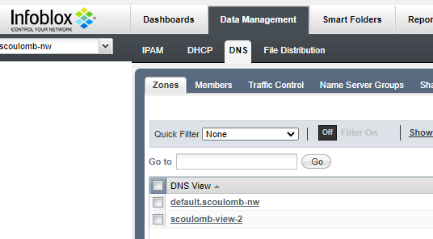

# DNS: Infoblox API overview

## Infoblox Record API overview

````
export API_ENDPOINT="x.x.x.x" # or FQDN to DNS
export USERNAME=""
export PASSWORD=""
echo -n "$USERNAME:$PASSWORD" > ~/admin-credentials
````

### POST CNAME

````
export reference=$(curl -k -H "Authorization: Basic $(cat ~/admin-credentials | base64)" \
        -H "Content-Type: application/json" \
        -X POST \
        -d '{"name":"test-infoblox-api-cname1.test.loc","canonical":"tes4.test.loc"}' \
        https://$API_ENDPOINT/wapi/v2.5/record:cname)
        
# https://stackoverflow.com/questions/9733338/shell-script-remove-first-and-last-quote-from-a-variable
export reference_without_quote=$(sed -e 's/^"//' -e 's/"$//' <<< $reference)
````

### GET CNAME
````
curl -k -H "Authorization: Basic $(cat ~/admin-credentials | base64)" \
        -H "Content-Type: application/json" \
        -X GET \
        "https://$API_ENDPOINT/wapi/v2.5/$reference_without_quote"
````
### DELETE CNAME
````
curl -k -H "Authorization: Basic $(cat ~/admin-credentials | base64)" \
        -H "Content-Type: application/json" \
        -X DELETE \
        "https://$API_ENDPOINT/wapi/v2.5/$reference_without_quote"
````
### POST HOST RECORD
````
export reference=$(curl -k -H "Authorization: Basic $(cat ~/admin-credentials | base64)" \
        -H "Content-Type: application/json" \
        -X POST \
        -d '{"name":"test-infoblox-api-host1.test.loc","view":"default","ipv4addrs":[{"ipv4addr":"4.4.4.2"}]}' \
        https://$API_ENDPOINT/wapi/v2.5/record:host)
        
export reference_without_quote=$(sed -e 's/^"//' -e 's/"$//' <<< $reference)
````
### DELETE HOST RECORD
````
curl -k -H "Authorization: Basic $(cat ~/admin-credentials | base64)" \
        -H "Content-Type: application/json" \
        -X DELETE \
        "https://$API_ENDPOINT/wapi/v2.5/$reference_without_quote"
````
### POST PTR
````
curl -k -H "Authorization: Basic $(cat ~/admin-credentials | base64)" \
        -H "Content-Type: application/json" \
        -X POST \
        -d '{"name":"2.10.10.10.in-addr.arpa", "ptrdname":"server1.info.com","ipv4addr":"10.10.10.2"}' \
        https://$API_ENDPOINT/wapi/v2.5/record:ptr
````       
### POST A
````
curl -k -H "Authorization: Basic $(cat ~/admin-credentials | base64)" \
        -H "Content-Type: application/json" \
        -X POST \
        -d '{"name":"test-infoblox-api-a1.test.loc","ipv4addr":"10.10.10.2"}' \
        https://$API_ENDPOINT/wapi/v2.5/record:a
````
### FIND A by name

 ````      
curl -k -H "Authorization: Basic $(cat ~/admin-credentials | base64)" \
        -H "Content-Type: application/json" \
        -X GET \
        "https://$API_ENDPOINT/wapi/v2.5/record:a?name=test-infoblox-api-a1.test.loc"
````

Name is an array, when it is on the name based on observation above I expect 1 result.
But it is an array as we can search on other view such as the view.

### Find CNAME by view
````
curl -k -H "Authorization: Basic $(cat ~/admin-credentials | base64)" \
        -H "Content-Type: application/json" \
        -X GET \
        "https://$API_ENDPOINT/wapi/v2.5/record:a?view=default"
````

### All those records are created in default view, which is attached to default network view.


We will prove it

````shell script
export REF=$(curl -k -u admin:infoblox \
        -H "Content-Type: application/json" \
        -X POST \
        -d '{"name":"test-infoblox-api-host-p.test.loc","view":"default","ipv4addrs":[{"ipv4addr":"4.4.4.2"}]}' \
        https://$API_ENDPOINT/wapi/v2.5/record:host)
        

$ echo $REF | tr -d '"'
record:host/ZG5zLmhvc3QkLl9kZWZhdWx0LmxvYy50ZXN0LnRlc3QtaW5mb2Jsb3gtYXBpLWhvc3QtcA:test-infoblox-api-host-p.test.loc/default

````

<!-- can use tr -d "'" and -u, see jupyter -->

We can see at enf of ref we use the default view.

````shell script
curl -k -u admin:infoblox -H 'content-type: application/json' -X GET "https://$API_ENDPOINT/wapi/v2.5/view" -d '{"name": "default"}'
curl -k -u admin:infoblox -H 'content-type: application/json' -X GET "https://$API_ENDPOINT/wapi/v2.5/view?_return_fields%2B=network_view" -d '{"name": "default"}'
````

Output is

````shell script
]$ curl -k -u admin:infoblox -H 'content-type: application/json' -X GET "https://$API_ENDPOINT/wapi/v2.5/view?_return_fields%2B=network_view" -d '{"name": "default"}'
[
    {
        "_ref": "view/ZG5zLnZpZXckLl9kZWZhdWx0:default/true",
        "is_default": true,
        "name": "default",
        "network_view": "default"
    }
]
````

Which confirms **default view is attached to default network view.**


## Infoblox Network view and View and Zone creation


From https://www.infoblox.com/wp-content/uploads/infoblox-deployment-infoblox-rest-api.pdf (p55):

> DNS views provide the ability to serve one version of DNS data to one set of clients and another version to
another set of clients. With DNS views, the appliance can provide a different answer to the same query,
depending on the source of the query.

### Prepare 

````shell script
sudo pacman -S jq
export API_ENDPOINT="dns_server_dns_name" # IP or FQDN to DNS
export USERNAME="admin"
export PASSWORD="infoblox"
````

In example below, I replaced doc username and password by en var. Note the usage of `-u` options.
We are also using v2.5. Also doc does not show a full consistent example.

### Experiment

#### Create a network view and implicit default view for that network 

(view default.$networkName)

````shell script
curl -k -u $USERNAME:$PASSWORD -H 'content-type: application/json' -X POST "https://$API_ENDPOINT/wapi/v2.5/networkview?_return_fields%2B=name&_return_as_object=1" -d '{"name":
"scoulomb-nw"}'

export network_view_id=$(curl -k -u $USERNAME:$PASSWORD \
        -H "Content-Type: application/json" \
        -X GET \
        "https://$API_ENDPOINT/wapi/v2.5/networkview?name=scoulomb-nw" |  jq .[0]._ref |  tr -d '"')
echo $network_view_id
````

This will implicitly create a custom view for that network (**default (generated) view for that custom network**)  

````shell script
[vagrant@archlinux ~]$ curl -k -u $USERNAME:$PASSWORD -H 'content-type: application/json' -X GET https://$API_ENDPOINT/wapi/v2.5/view | grep -C 2 "scoulomb-nw"
  % Total    % Received % Xferd  Average Speed   Time    Time     Time  Current
                                 Dload  Upload   Total   Spent    Left  Speed
100  1138    0  1138    0     0   3270      0 --:--:-- --:--:-- --:--:--  3279
    },
    {
        "_ref": "view/ZG5zLnZpZXckLjE3:default.scoulomb-nw/false",
        "is_default": false,
        "name": "default.scoulomb-nw"
    },
    {
````

or 

````shell script
 curl -k -u $USERNAME:$PASSWORD -H 'content-type: application/json' -X GET https://$API_ENDPOINT/wapi/v2.5/view -d '{"name": "default.scoulomb-nw"}'
````

If deleted :

````shell script
curl -k -u $USERNAME:$PASSWORD -H "Content-Type: application/json" -X DELETE "https://$API_ENDPOINT/wapi/v2.5/$network_view_id"
````

View is also deleted.

````shell script
$ curl -k -u $USERNAME:$PASSWORD -H 'content-type: application/json' -X GET https://$API_ENDPOINT/wapi/v2.5/view -d '{"name": "default.scoulomb-nw"}'
[]
````

Re-create it for next steps.

##### We could create a custom view directly without network

````shell script
curl -k -u $USERNAME:$PASSWORD -H 'content-type: application/json' -X POST "https://$API_ENDPOINT/wapi/v2.5/view" -d '{"name": "scoulomb-view"}'

export direct_view_id=$(curl -k -u $USERNAME:$PASSWORD \
        -H "Content-Type: application/json" \
        -X GET \
        "https://$API_ENDPOINT/wapi/v2.5/view?name=scoulomb-view" |  jq .[0]._ref |  tr -d '"')
echo $direct_view_id
````

This one will appear in UI in dns/zones unkike indirect one.
We will see [later](#Then-create-a-host-record-within-a zone in the 2 different views) that this view is attached to the default network.

#### And create an authoritative zone within a view

````shell script
curl -k -u $USERNAME:$PASSWORD -H 'content-type: application/json' -X POST "https://$API_ENDPOINT/wapi/v2.5/zone_auth?_return_fields%2B=fqdn,network_view&_return_as_object=1" -d \
'{"fqdn": "mylabserver-scoulomb.com","view": "yop"}'
````

Ouput is 

````shell script
{ "Error": "AdmConDataNotFoundError: View yop not found",
  "code": "Client.Ibap.Data.NotFound",
  "text": "View yop not found"
}
````

So we use previous created view via network view (default.$networkName)

````shell script
curl -k -u $USERNAME:$PASSWORD -H 'content-type: application/json' -X POST "https://$API_ENDPOINT/wapi/v2.5/zone_auth?_return_fields%2B=fqdn,network_view&_return_as_object=1" -d \
'{"fqdn": "mylabserver-scoulomb.com","view": "default.scoulomb-nw"}'

````

He we use previous created view via direct view creation (which will see uses default network)

````shell script
curl -k -u $USERNAME:$PASSWORD -H 'content-type: application/json' -X POST "https://$API_ENDPOINT/wapi/v2.5/zone_auth?_return_fields%2B=fqdn,network_view&_return_as_object=1" -d \
'{"fqdn": "mylabserver-scoulomb.com","view": "scoulomb-view"}'
````

And store zone id

````shell script
export find_zone_res=$(curl -k -u $USERNAME:$PASSWORD \
        -H "Content-Type: application/json" \
        -X GET \
        "https://$API_ENDPOINT/wapi/v2.5/zone_auth?fqdn=mylabserver-scoulomb.com")

export view1_zone_mylabserver_scoulomb_com=$(echo $find_zone_res | jq .[0]._ref |  tr -d '"')
export view2_zone_mylabserver_scoulomb_com=$(echo $find_zone_res | jq .[1]._ref |  tr -d '"')
echo $view1_zone_mylabserver_scoulomb_com
echo $view2_zone_mylabserver_scoulomb_com
````

Same zone is created in 2 different view.

#### Then create a host record within a zone in the 2 different views

(as done above)

````shell script
curl -k -u $USERNAME:$PASSWORD -H 'content-type: application/json' -X POST "https://$API_ENDPOINT/wapi/v2.5/record:host?_return_fields%2B=name,network_view&_return_as_object=1" -d \
'{"name":"host.mylabserver-scoulomb.com","ipv4addrs": [{"ipv4addr":"41.41.41.41"}],"view": "default.scoulomb-nw"}'

curl -k -u $USERNAME:$PASSWORD -H 'content-type: application/json' -X POST "https://$API_ENDPOINT/wapi/v2.5/record:host?_return_fields%2B=name,network_view&_return_as_object=1" -d \
'{"name":"host.mylabserver-scoulomb.com","ipv4addrs": [{"ipv4addr":"42.42.42.42"}],"view": "scoulomb-view"}'


export find_host_record_res=$(curl -k -u $USERNAME:$PASSWORD \
        -H "Content-Type: application/json" \
        -X GET \
        "https://$API_ENDPOINT/wapi/v2.5/record:host?name=host.mylabserver-scoulomb.com")
# Do not do this ! ?_return_fields%2B=name,network_view&_return_as_object=1")

export host_view1_zone_mylabserver_scoulomb_com=$(echo $find_host_record_res | jq .[0]._ref |  tr -d '"')
export host_view2_zone_mylabserver_scoulomb_com=$(echo $find_host_record_res | jq .[1]._ref |  tr -d '"')
echo $host_view1_zone_mylabserver_scoulomb_com
echo $host_view2_zone_mylabserver_scoulomb_com

````

As for the create we can request to return the network view:

```shell script
curl -k -u $USERNAME:$PASSWORD -H "Content-Type: application/json"-X GET "https://$API_ENDPOINT/wapi/v2.5/record:host?name=host.mylabserver-scoulomb.com&_return_fields%2B=name,network_view&_return_as_object=1" | jq
```

Where output is 

````json
{
  "result": [
    {
      "_ref": "record:host/<uid-1>:host.mylabserver-scoulomb.com/scoulomb-view",
      "ipv4addrs": [
        {
          "_ref": "record:host_ipv4addr/<uid-1-ipv4>:42.42.42.42/host.mylabserver-scoulomb.com/scoulomb-view",
          "configure_for_dhcp": false,
          "host": "host.mylabserver-scoulomb.com",
          "ipv4addr": "42.42.42.42"
        }
      ],
      "name": "host.mylabserver-scoulomb.com",
      "network_view": "default",
      "view": "scoulomb-view"
    },
    {
      "_ref": "record:host/<uid-2>:host.mylabserver-scoulomb.com/default.scoulomb-nw",
      "ipv4addrs": [
        {
          "_ref": "record:host_ipv4addr/<uid-2-ipv4>:41.41.41.41/host.mylabserver-scoulomb.com/default.scoulomb-nw",
          "configure_for_dhcp": false,
          "host": "host.mylabserver-scoulomb.com",
          "ipv4addr": "41.41.41.41"
        }
      ],
      "name": "host.mylabserver-scoulomb.com",
      "network_view": "scoulomb-nw",
      "view": "default.scoulomb-nw"
    }
  ]
}
````


As in p56 of Infoblox PDF we can see custom direct view creation use default network view.
And default.scoulomb-nw view uses scoulomb-nw network view.
Same record is created in zone with same name but 2 different view.

#### Can I decide to make custom direct view creation

and assign it to a network view?

````shell script
curl -k -u $USERNAME:$PASSWORD -H 'content-type: application/json' -X POST "https://$API_ENDPOINT/wapi/v2.5/view" -d '{"name": "scoulomb-view-2", "network_view": "scoulomb-nw"}'

export direct_view_assigned_to_scoulomb_nw_id=$(curl -k -u $USERNAME:$PASSWORD \
        -H "Content-Type: application/json" \
        -X GET \
        "https://$API_ENDPOINT/wapi/v2.5/view?name=scoulomb-view-2" |  jq .[0]._ref |  tr -d '"')
echo $direct_view_assigned_to_scoulomb_nw_id

curl -k -u $USERNAME:$PASSWORD -H 'content-type: application/json' -X GET "https://$API_ENDPOINT/wapi/v2.5/$direct_view_assigned_to_scoulomb_nw_id?_return_fields%2B=name,network_view&_return_as_object=1" | jq
````

Output is 

````shell script
{
  "result": {
    "_ref": "view/ZG5zLnZpZXckLjI0:scoulomb-view-2/false",
    "is_default": false,
    "name": "scoulomb-view-2",
    "network_view": "scoulomb-nw"
  }
}
````

Answer is yes.

In Infoblox UI, not we have the network dropdown at top left where was can see the view attached to that network.



We need several view to make the view list appear.
<!--
Add this when did Terraform in my IaC OK
And test delete from UI
https://github.com/scoulomb/myIaC/blob/master/terraform/README-terraform-infoblox.md
If apply all proc here will be same result OK

-->
 
#### Add a network within a network view


````shell script
curl -k -u $USERNAME:$PASSWORD -H 'content-type: application/json' -X POST "https://$API_ENDPOINT/wapi/v2.5/network?_return_fields%2B=network&_return_as_object=1 " -d '{"network":
"0.0.0.0/1","network_view": "scoulomb-nw"}'

export network_id=$(curl -k -u $USERNAME:$PASSWORD \
        -H "Content-Type: application/json" \
        -X GET \
        "https://$API_ENDPOINT/wapi/v2.5/network?network_view=scoulomb-nw" |  jq .[0]._ref |  tr -d '"')
echo $network_id
````

#### Clean up

```shell script
curl -k -u $USERNAME:$PASSWORD \
        -H "Content-Type: application/json" \
        -X DELETE \
        "https://$API_ENDPOINT/wapi/v2.5/$network_id"

curl -k -u $USERNAME:$PASSWORD \
        -H "Content-Type: application/json" \
        -X DELETE \
        "https://$API_ENDPOINT/wapi/v2.5/$host_view1_zone_mylabserver_scoulomb_com"

curl -k -u $USERNAME:$PASSWORD \
        -H "Content-Type: application/json" \
        -X DELETE \
        "https://$API_ENDPOINT/wapi/v2.5/$host_view2_zone_mylabserver_scoulomb_com"

curl -k -u $USERNAME:$PASSWORD \
        -H "Content-Type: application/json" \
        -X DELETE \
        "https://$API_ENDPOINT/wapi/v2.5/$view1_zone_mylabserver_scoulomb_com"

curl -k -u $USERNAME:$PASSWORD \
        -H "Content-Type: application/json" \
        -X DELETE \
        "https://$API_ENDPOINT/wapi/v2.5/$view2_zone_mylabserver_scoulomb_com"

curl -k -u $USERNAME:$PASSWORD \
        -H "Content-Type: application/json" \
        -X DELETE \
        "https://$API_ENDPOINT/wapi/v2.5/$direct_view_assigned_to_scoulomb_nw_id"


curl -k -u $USERNAME:$PASSWORD \
        -H "Content-Type: application/json" \
        -X DELETE \
        "https://$API_ENDPOINT/wapi/v2.5/$direct_view_id"


curl -k -u $USERNAME:$PASSWORD \
        -H "Content-Type: application/json" \
        -X DELETE \
        "https://$API_ENDPOINT/wapi/v2.5/$network_view_id"
# This will actually perform cascade deletion include network (except $direct_view_assigned_to_scoulomb_nw_id), and when restore with recycle bin id are kept
```

#### Parenthesis on default view and nslookup 

When using view `default` (real default, not default of the network -> default view attached to default network), we can do a lookup in this setup.

````shell script
curl -k -u $USERNAME:$PASSWORD -H 'content-type: application/json' -X POST "https://$API_ENDPOINT/wapi/v2.5/record:host?_return_fields%2B=name,network_view&_return_as_object=1" -d \
'{"name":"host.mylabserver-scoulomb.com","ipv4addrs": [{"ipv4addr":"41.41.41.41"}],"view": "default"}'

curl -k -u $USERNAME:$PASSWORD -H 'content-type: application/json' -X POST "https://$API_ENDPOINT/wapi/v2.5/record:host?_return_fields%2B=name,network_view&_return_as_object=1" -d \
'{"name":"host.test.loc","ipv4addrs": [{"ipv4addr":"41.41.41.41"}],"view": "default"}'

nslookup host.test.loc $API_SERVER
````

This first command for creation will fail as this zone is not defined in the default view.
So we use a zone defined in default view.

Output is 

```shell script

[vagrant@archlinux ~]$ curl -k -u $USERNAME:$PASSWORD -H 'content-type: application/json' -X POST "https://$API_ENDPOINT/wapi/v2.5/record:host?_re
bject=1" -d \                                                                                                                                     
> '{"name":"host.mylabserver-scoulomb.com","ipv4addrs": [{"ipv4addr":"41.41.41.41"}],"view": "default"}'                                          
{ "Error": "AdmConDataError: None (IBDataConflictError: IB.Data.Conflict:The action is not allowed. A parent was not found.)",                    
  "code": "Client.Ibap.Data.Conflict",                                                                                                            
  "text": "The action is not allowed. A parent was not found."                                                                                    
}[vagrant@archlinux ~]$ curl -k -u $USERNAME:$PASSWORD -H 'content-type: application/json' -X POST "https://$API_ENDPOINT/wapi/v2.5/record:host?_r
object=1" -d \                                                                                                                                    
> '{"name":"host.test.loc","ipv4addrs": [{"ipv4addr":"41.41.41.41"}],"view": "default"}'                                                          
{                                                                                                                                                 
    "result": {                                                                                                                                   
        "_ref": "record:host/<uid>:host.test.loc/default",                                                  
[...]

$ nslookup host.test.loc $API_ENDPOINT
Server:         dns_server_dns_name
Address:        $dns_server_ip#53

Name:   host.test.loc
Address: 41.41.41.41

```

I did not check this further (restart, extra conf, subnet match, acl...) why we can do only nslookup on default view (attached to default network) from laptop.

Getting this record
````
curl -k -u $USERNAME:$PASSWORD -H "Content-Type: application/json"-X GET "https://$API_ENDPOINT/wapi/v2.5/record:host?name=host.test.loc&_return_fields%2B=name,network_view&_return_as_object=1" | jq
````

Output is 

````shell script
{
  "result": [
    {
      "_ref": "record:host/<uid>:host.test.loc/default",
      "ipv4addrs": [
        {
          "_ref": "record:host_ipv4addr/<uid-ipv4>:41.41.41.41/host.test.loc/default",
          "configure_for_dhcp": false,
          "host": "host.test.loc",
          "ipv4addr": "41.41.41.41"
        }
      ],
      "name": "host.test.loc",
      "network_view": "default",
      "view": "default"
    }
  ]
}
````

We can see default network view is used.

        
### API Impact and wrapup

From record perspective confirms a record belongs to view and a view is attached to a network view.

Thus we have a

- one or several records inside a zone 
- one or several zones zone inside a view 
=> we can define a zone multiple time in different views (dns query result will be based on ACLs attached to the view). Cf [here](#Then-create-a-host-record-within-a-zone-in-the-2-different-views).
- a view is attached to a single network view, a network view can be attached to several views (cf default.$networkName and custom view attached to a network). Cf [here](#Can-I-decide-to-make-custom-direct-view-creation).
-  one or several networks can be attached to network view. Cf [here](#Add-a-network-within-a-network-view).

Appliance behavior:

1. Default view is attached to default network view.Cf [here](#We-could-create-a-custom-view-directly-without-network) and [here](#Then-create-a-host-record-within-a-zone-in-the-2-different-views)
2. default.$networkName view is attached to $networkName network view (at network view creation). Cf [here](#Create-a-network-view-and-implicit-default-view-for-that-network).
3. Any custom view created explicitly can be attached to a network view explicitly. Cf [here](#Can-I-decide-to-make-custom-direct-view-creation-and assign-it-to-a-network-view?).
4. When creating a view explicitly it is attached by default to the default network view. Cf [here](#We-could-create-a-custom-view-directly-without-network).

It is compliant with this doc:
https://docs.infoblox.com/display/NAG8/Chapter+18+DNS+Views

> The NIOS appliance provides one default DNS view, which is always associated with the default network view. 
>
> You can create additional network and DNS views
>
> The default DNS view initially allows all IP addresses access, and has the same recursion setting as the Grid. You can change these properties and rename the default DNS view, but you cannot delete it. 
>
> When you create a network view, the appliance automatically creates a corresponding DNS view with "default." prepended to the name of the network view. 
> 
>A DNS view can be in one network view only, but a network view can have multiple DNS views.

Cf [here](#Can-I-decide-to-make-custom-direct-view-creation-and assign-it-to-a-network-view?) for last bullet.

All of this shown in experience.

### Why do we need this network view?

From: https://docs.infoblox.com/display/nios84/Configuring+Network+Views

> A network view is a single routing domain with its own networks and shared networks. A network view can contain both IPv4 and IPv6 networks. All networks must belong to a network view.
> You can manage the networks in one network view independently of the other network views.
> Because network views are mutually exclusive, the networks in each view can have overlapping address spaces with multiple duplicate IP addresses without impacting network integrity.

Cf [here](#Add-a-network-within-a-network-view).

> A Grid member can serve one network view only, but a network view can be served by multiple Grid members.
> The NIOS appliance provides one default network view. You can rename the default view and change its settings, but you cannot delete it. There must always be at least one network view in the appliance. If you do not need to manage overlapping IP address spaces in your organization, you can use the system-defined network view for all your networks. 

> **You do not need to create additional network views. But if there are overlapping IP address spaces and you need more than one network view, you can create up to 1000 network views.**

**This means we will usually use 1 and 4 behavior from [wrap-up](#API-Impact-and-wrapup)**

> Each network view must be associated with at least one DNS view. The default network view is always associated with the default DNS view, which also cannot be deleted.

Cf [here](#We-could-create-a-custom-view-directly-without-network) and [here](#Then-create-a-host-record-within-a-zone-in-the-2-different-views)

> When you create a network view, the appliance automatically creates a corresponding DNS view with the same name as the network view, but with "default" prepended to the name. You can then rename that system-defined DNS view, but you cannot delete it.

Cf [here](#Create-a-network-view-and-implicit-default-view-for-that-network).

> A network view can be associated with multiple DNS views (as shown in Figure 25.12), but a DNS view cannot be associated with more than one network view. Each network view must be associated with a unique set of DNS views.

### How to have a different answer based on client ip with the view mechanism as done with bind9

It is not performed with network view!
From: https://docs.infoblox.com/display/NAG8/Configuring+DNS+Views

> You can add up to 1000 DNS views. When you add a DNS view, specify the following:
> - The network view in which you are creating the DNS view.
> - A Match Clients list specifying the hosts allowed access to the DNS view.
> **If you do not define a list, the appliance allows all hosts to access the DNS view.** For more information, see [Defining Match Clients Lists](https://docs.infoblox.com/display/NAG8/Configuring+DNS+Views#ConfiguringDNSViews-bookmark1694)
> - Whether recursive queries are allowed.
When a name server is authoritative for the zones in a DNS view, you can disable recursion since your name server should be able to respond to the queries without having to query other servers.
if you want to allow a Grid member to respond to recursive queries from specific IP addresses, you can create an empty DNS view, that is, one that has no zones in it, and enable recursion. 

First bullet is the one we have seen before.

To have equivalent we need 
>  A Match Clients list specifying the hosts allowed access to the DNS view.
 
And from [same page](https://docs.infoblox.com/display/NAG8/Configuring+DNS+Views#ConfiguringDNSViews-bookmark1694):

> Defining a Match Destinations List
> You can define a Match Destinations list that identifies destination addresses and TSIG keys that are allowed access to a DNS view. When the NIOS appliance receives a DNS request from a client, it tries to match the destination address or TSIG key in the incoming message with its Match Destination list to determine which DNS view, if any, the client can access. After the appliance determines that a host can access a DNS view, it checks the zone level settings to determine whether it can provide the service that the host is requesting for that zone.
> You can define a Match Destination list when you edit an existing DNS view as follows:

This list is known as an ACL.
Then we have the question what happens if several ACL match the view.
This was asked for bind9 in [Serverfault](https://serverfault.com/questions/784576/with-bind-9-how-can-i-match-clients-in-multiple-views).

> It can't be done the way you want to achieve it. View matching stops at the first match, and outside views, only one default set of entries can exist. A client can match only one set of zones.

And we find same behavior for Infoblox view [in same page doc](https://docs.infoblox.com/display/NAG8/Configuring+DNS+Views):
> Managing the Order of DNS Views
> When a member receives a query from a DNS client, it checks the Match Client lists in the order the DNS views are listed in the Order of DNS Views table of the DNS Views tab in the DNS Member editor. The NIOS appliance can order DNS views automatically, or you can order the DNS views manually.

This way we understand why UI has an ACL at view level.
It seems not possible to edit view ACL with API.
View appears when correct network view is selected. Cf [here](#Can-I-decide-to-make-custom-direct-view-creation).
(view can be attached to a single network view, but not the contrary)


It is similar to [F5 route domain](https://techdocs.f5.com/kb/en-us/products/big-ip_ltm/manuals/product/tmos-routing-administration-11-6-0/8.html):
> A route domain is a configuration object that isolates network traffic for a particular application on the network.
> Because route domains segment network traffic, you can assign the same IP address or subnet to multiple nodes on a network, provided that each instance of the IP address resides in a separate routing domain.

See link with [Terraform plugin](https://github.com/scoulomb/myIaC/tree/master/terraform)

Go client takes network view and CIDR as input parameter for automatic IP allocation when creating a A record or Host record (check go code [here](https://github.com/infobloxopen/infoblox-go-client/blob/master/object_manager.go)).
This is explained here in [myIAC](https://github.com/scoulomb/myIaC/blob/master/terraform/README-terraform-infoblox-part2-resource.md#plugin-code-and-analysis).


## Infoblox TTL


<details>
  <summary>Infoblox has also a TTL at record level, we can define TTL at zone and global level</summary>
  
  
````json
{
    "name": "testttl.test.loc",
    "view": "default",
    "ipv4addrs": [{
        "ipv4addr": "4.4.4.2"
    }, {
        "ipv4addr": "4.4.4.5"
    }],
	  "ttl": 3600,
	  "use_ttl": true
}
````

It is similar in bind9: https://www.zytrax.com/books//dns/apa/ttl.html
> The default TTL for the zone is defined in BIND9 by the $TTL directive which must appear at the beginning of the zone file, that is, before any RR to which it will apply. This $TTL is used for any Resource Record which does not explicitly set the 'ttl' field.

</details>

Source**: [Infoblox REST API Nios 8.5 ref](https://www.infoblox.com/wp-content/uploads/infoblox-deployment-infoblox-rest-api.pdf) (p13/56)

## Views


````shell script
curl -k -H "Authorization: Basic $(cat ~/admin-credentials | base64)" \
        -H "Content-Type: application/json" \
        -X POST \
        -d '{"name":"test-infoblox-api-view.test.loc","view":"default","ipv4addrs":[{"ipv4addr":"4.4.4.2"}]}' \
        https://$API_ENDPOINT/wapi/v2.5/record:host

curl -k -H "Authorization: Basic $(cat ~/admin-credentials | base64)" \
        -H "Content-Type: application/json" \
        -X POST \
        -d '{"name":"test-infoblox-api-view.test.loc", "view":"another_view", "ipv4addrs":[{"ipv4addr":"4.4.4.2"}]}' \
        https://$API_ENDPOINT/wapi/v2.5/record:host

curl -k -H "Authorization: Basic $(cat ~/admin-credentials | base64)" \
        -H "Content-Type: application/json" \
        -X GET \
        "https://$API_ENDPOINT/wapi/v2.5/record:host?name=test-infoblox-api-view.test.loc"

curl -k -H "Authorization: Basic $(cat ~/admin-credentials | base64)" \
        -H "Content-Type: application/json" \
        -X GET \
        "https://$API_ENDPOINT/wapi/v2.5/record:host?name=test-infoblox-api-view.test.loc&view=default"

````

Output is 


````shell script
[vagrant@archlinux ~]$ curl -k -H "Authorization: Basic $(cat ~/admin-credentials | base64)" \
>         -H "Content-Type: application/json" \
>         -X GET \
>         "https://$API_ENDPOINT/wapi/v2.5/record:host?name=test-infoblox-api-view.test.loc"
[
    {
        "_ref": "record:host/<uid>:test-infoblox-api-view.test.loc/another_view",
        "ipv4addrs": [
            {
                "_ref": "record:host_ipv4addr/<uid>:4.4.4.2/test-infoblox-api-view.test.loc/another_view",
                "configure_for_dhcp": false,
                "host": "test-infoblox-api-view.test.loc",
                "ipv4addr": "4.4.4.2"
            }
        ],
        "name": "test-infoblox-api-view.test.loc",
        "view": "another_view"
    },
    {
        "_ref": "record:host/<uid>:test-infoblox-api-view.test.loc/default",
        "ipv4addrs": [
            {
                "_ref": "record:host_ipv4addr/<uid>:4.4.4.2/test-infoblox-api-view.test.loc/default",
                "configure_for_dhcp": false,
                "host": "test-infoblox-api-view.test.loc",
                "ipv4addr": "4.4.4.2"
            }
        ],
        "name": "test-infoblox-api-view.test.loc",
        "view": "default"
    }
]
[vagrant@archlinux ~]
$ curl -k -H "Authorization: Basic $(cat ~/admin-credentials | base64)" \
>         -H "Content-Type: application/json" \
>         -X GET \
>         "https://$API_ENDPOINT/wapi/v2.5/record:host?name=test-infoblox-api-view.test.loc&view=default"
[
    {
        "_ref": "record:host/<uid>:test-infoblox-api-view.test.loc/default",
        "ipv4addrs": [
            {
                "_ref": "record:host_ipv4addr/<uid>:4.4.4.2/test-infoblox-api-view.test.loc/default",
                "configure_for_dhcp": false,
                "host": "test-infoblox-api-view.test.loc",
                "ipv4addr": "4.4.4.2"
            }
        ],
        "name": "test-infoblox-api-view.test.loc",
        "view": "default"
    }
]
````

So we have to mention the view in the search.
`another_view` is a view existing on the system, with `test.loc` zone created on this view.
See above for creation or replace by existing zone (tested both).

However if we do a nslookup only record in default view is [visible](#Parenthesis-on-default-view-and-nslookup) in our setup (no restart impact as existing view leads to same results?).

The fact it returns records in different view is used [here](#And-create-an-authoritative-zone-within-a-view).


##### Network view direct access

DNS View, network view and ACL.
And why some Infoblox client use network view at record creation (dynamic IP allocation)

- https://github.com/scoulomb/myDNS/blob/master/3-DNS-solution-providers/1-Infoblox/1-Infoblox-API-overview.md#api-impact-and-wrapup
- https://github.com/scoulomb/myIaC/blob/master/terraform/README-terraform-infoblox-part2-resource.md#a-record-unused-fields
- https://github.com/scoulomb/myDNS/blob/master/4-Analysis/1-comparison-table.md (where network view is not acl)