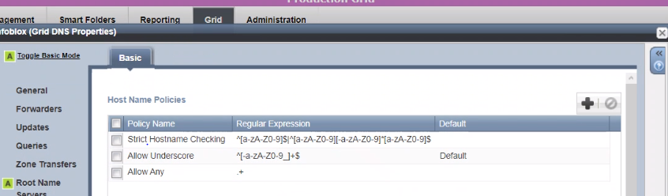

# What is a valid Hostname?

Should I accept an entry like "my_record.test.loc" ? (`_`, underscore )

## From IETF mailarchive

**Source** 
- https://serverfault.com/questions/911043/which-characters-values-are-allowed-to-use-in-dns (answer is not that accurate) 
- https://mailarchive.ietf.org/arch/msg/dnsop/Yi8PvVDKNdS8OEs25QkvxjP0SMM/

Note
- hostnames are a subset of domain names
- domain name != hostname

## From Zytrax on Valid Names and Labels
 
**Source**: https://www.zytrax.com/books/dns/apa/names.html:


Host Names (or 'labels' in DNS jargon) were traditionally defined by RFC 952 and RFC 1123 and may be composed of the following valid characters.

````shell script
A to Z ; upper case characters
a to z ; lower case characters
0 to 9 ; numeric characters 0 to 9
-      ; dash
````

The rules say:

- A host name (label) can start or end with a letter or a number
- A host name (label) MUST NOT start or end with a '-' (dash)
- A host name (label) MUST NOT consist of all numeric values
- A host name (label) can be up to 63 characters

**RFC 2181 significantly liberalized the valid character set including the use of "_" (underscore) essentially saying that anything goes and its up to the client to validate in context.**

If you want to be safe stick with the rules above if you need the expanded capabilities (e.g. SRV RRs) use them. 
However you are taking a risk that one vital system will not talk to you at 3AM in the morning due to an upgrade!

The named.conf statement check-names allows control over the names accepted.

Domain names are defined to be case insensitive (essentially so you don't have to register every possible variant of your domain name) but the rule is that case should be preserved since this may change in the future. Host names seem to obey the same rules - essentially as an artifact of subdomains.

Host Name Examples
; for clarity we show a host name in A records

````shell script
www        IN      A      192.168.0.3 ; valid
wWw        IN      A      192.168.0.3 ; valid
my www     IN      A      192.168.0.3 ; invalid
my-www     IN      A      192.168.0.3 ; valid
my_www     IN      A      192.168.0.3 ; invalid but may work
3www       IN      A      192.168.0.3 ; valid
-www       IN      A      192.168.0.3 ; invalid
5512       IN      A      192.168.0.3 ; invalid
host-5512  IN      A      192.168.0.3 ; valid
@www       IN      A      192.168.0.3 ; invalid
````

## From man page

https://man7.org/linux/man-pages/man7/hostname.7.html

>  Each element of the hostname must be from 1 to 63 characters long and
   the entire hostname, including the dots, can be at most 253
   characters long.  Valid characters for hostnames are ASCII(7) letters
   from a to z, the digits from 0 to 9, and the hyphen (-).  A hostname
   may not start with a hyphen.

Man page does not update with **RFC 2181** (mentioned in Zytrax)

## Validation can be implementation dependent 

https://serverfault.com/questions/911043/which-characters-values-are-allowed-to-use-in-dns
As also mentionned in [Zytrax](#from-zytrax-on-valid-names-and-labels).

## From RFC

[Zytrax](#from-zytrax-on-valid-names-and-labels) mentionned RFC 2181.

https://tools.ietf.org/html/rfc2181

> The DNS itself places only one restriction on the particular labels
that can be used to identify resource records.  That one restriction
relates to the length of the label and the full name.  The length of
any one label is limited to between 1 and 63 octets.  A full domain
name is limited to 255 octets (including the separators).  The zero
length full name is defined as representing the root of the DNS tree,
and is typically written and displayed as ".".  Those restrictions
aside, any binary string whatever can be used as the label of any
resource record.  

Which refers: https://tools.ietf.org/html/rfc1123#section-6.1.3.5
=> https://tools.ietf.org/html/rfc1123#page-79.
And give the details of hostname restriction:

> The DNS defines domain name syntax very generally -- a
string of labels each containing up to 63 8-bit octets,
separated by dots, and with a maximum total of 255
octets.  Particular applications of the DNS are
permitted to further constrain the syntax of the domain
names they use, although the DNS deployment has led to
some applications allowing more general names.  In
particular, Section 2.1 of **this document liberalizes
slightly the syntax of a legal Internet host name that
was defined in RFC-952 [DNS:4].**

New valid hostnames are define in section 2.1 of same doc here:
https://tools.ietf.org/html/rfc1123#section-2.1

> The syntax of a legal Internet host name was specified in RFC-952
[DNS:4].  One aspect of host name syntax is hereby changed: the
restriction on the first character is relaxed to allow either a
letter or a digit.  Host software MUST support this more liberal
syntax.
Host software MUST handle host names of up to 63 characters and
SHOULD handle host names of up to 255 characters.
Whenever a user inputs the identity of an Internet host, it SHOULD
be possible to enter either (1) a host domain name or (2) an IP
address in dotted-decimal ("#.#.#.#") form.  The host SHOULD check
the string syntactically for a dotted-decimal number before
looking it up in the Domain Name System.

Thos overrides old RFC-952
https://tools.ietf.org/html/rfc952

>  A "name" (Net, Host, Gateway, or Domain name) is a text string up
to 24 characters drawn from the alphabet (A-Z), digits (0-9), minus
sign (-), and period (.).  Note that periods are only allowed when
they serve to delimit components of "domain style names". (See
RFC-921, "Domain Name System Implementation Schedule", for
background).  No blank or space characters are permitted as part of a
name. No distinction is made between upper and lower case.  The first
character must be an alpha character.  The last character must not be
a minus sign or period.  A host which serves as a GATEWAY should have
"-GATEWAY" or "-GW" as part of its name.  Hosts which do not serve as
Internet gateways should not use "-GATEWAY" and "-GW" as part of
their names. A host which is a TAC should have "-TAC" as the last
part of its host name, if it is a DoD host.  Single character names
or nicknames are not allowed.

So actually there is a lot of liberty for DNS implementation.

Zytrax actually summarizes well the situation:

````shell script
**RFC 2181 significantly liberalized the valid character set including the use of "_" (underscore) essentially saying that anything goes and its up to the client to validate in context.**

If you want to be safe stick with the rules above if you need the expanded capabilities (e.g. SRV RRs) use them. 
However you are taking a risk that one vital system will not talk to you at 3AM in the morning due to an upgrade!
````

## Testing some implementation

We can try:

- `scoulomb`
- `1scoulomb`
- `-scoulomb`
- `scoul_omb`
- `_scoulomb`
- `scoul_om@b`

### OpenAPI 

OpenAPI has format hostname: https://swagger.io/docs/specification/data-models/data-types/

For instance we can try:


````shell script
ObjectMetadata:
  type: object
  properties:
    name:
      type: string
      example: reneVM01
      format: hostname
````

- `scoulomb` OK
- `1scoulomb` OK
- `-scoulomb` KO

````shell script
{
  "errors": [
    {
      "code": 4926,
      "detail": "'-scoulomb' is not a 'hostname' - 'metadata.name'",
      "status": 400,
      "title": "INVALID DATA RECEIVED"
    }
  ]
}
````

- `scoul_omb` KO

````shell script
{
  "errors": [
    {
      "code": 4926,
      "detail": "'scoul_omb' is not a 'hostname' - 'metadata.name'",
      "status": 400,
      "title": "INVALID DATA RECEIVED"
    }
  ]
}
````

- `_scoulomb` KO
- `scoul_om@b` KO


<!-- See https://github.com/scoulomb/private_script/blob/main/dns-auto/nocommit_test_check_dup_name_ip_out.txt -->

### Infoblox

````shell script
clear
declare -a arr=("scoulomb" "1scoulomb" "-scoulomb" "scoul_omb" "_scoulomb" "scoul_om@b")
UUID=$(cat /proc/sys/kernel/random/uuid)

## now loop through the above array
for i in "${arr[@]}"
do
echo -e "= Test with $i \n"


echo -e "=== Sent payload \n"

payload=$(cat <<EOF
{
  "name": "$i.$UUID.test.loc",
  "view": "default",
  "ipv4addrs": [
    {
      "ipv4addr": "4.4.4.2"
    }
  ]
}
EOF
)
echo $payload | jq -M

echo -e "=== try to create \n"

curl -k -u admin:infoblox\
                -H "Content-Type: application/json" \
                -X POST \
                -d "$payload"\
                https://$API_ENDPOINT/wapi/v2.5/record:host

echo -e "\n=== try to lookup \n"

nslookup "$i.test1.test.loc" $API_ENDPOINT
echo -e "=------------------------------\n"

done
````

output is 


````shell script
= Test with scoulomb

=== Sent payload

{
  "name": "scoulomb.28f9ee78-d489-4f91-9836-2a46c7354240.test.loc",
  "view": "default",
  "ipv4addrs": [
    {
      "ipv4addr": "4.4.4.2"
    }
  ]
}
=== try to create

"record:host/ZG5zLmhvc3QkLl9kZWZhdWx0LmxvYy50ZXN0LjI4ZjllZTc4LWQ0ODktNGY5MS05ODM2LTJhNDZjNzM1NDI0MC5zY291bG9tYg:scoulomb.28f9ee78-d489-4f91-9836-2a46c7354240.test.loc/default"
=== try to lookup

Server:         <API SERVER NAME>
Address:        <API SERVER IP>#53

Name:   scoulomb.test1.test.loc
Address: 4.4.4.2

=------------------------------

= Test with 1scoulomb

=== Sent payload

{
  "name": "1scoulomb.28f9ee78-d489-4f91-9836-2a46c7354240.test.loc",
  "view": "default",
  "ipv4addrs": [
    {
      "ipv4addr": "4.4.4.2"
    }
  ]
}
=== try to create

"record:host/ZG5zLmhvc3QkLl9kZWZhdWx0LmxvYy50ZXN0LjI4ZjllZTc4LWQ0ODktNGY5MS05ODM2LTJhNDZjNzM1NDI0MC4xc2NvdWxvbWI:1scoulomb.28f9ee78-d489-4f91-9836-2a46c7354240.test.loc/default"
=== try to lookup

Server:         <API SERVER NAME>
Address:        <API SERVER IP>#53

Name:   1scoulomb.test1.test.loc
Address: 4.4.4.2

=------------------------------

= Test with -scoulomb

=== Sent payload

{
  "name": "-scoulomb.28f9ee78-d489-4f91-9836-2a46c7354240.test.loc",
  "view": "default",
  "ipv4addrs": [
    {
      "ipv4addr": "4.4.4.2"
    }
  ]
}
=== try to create

"record:host/ZG5zLmhvc3QkLl9kZWZhdWx0LmxvYy50ZXN0LjI4ZjllZTc4LWQ0ODktNGY5MS05ODM2LTJhNDZjNzM1NDI0MC4tc2NvdWxvbWI:-scoulomb.28f9ee78-d489-4f91-9836-2a46c7354240.test.loc/default"
=== try to lookup

*** Invalid option: scoulomb.test1.test.loc
Server:         10.0.2.3
Address:        10.0.2.3#53

Non-authoritative answer:
Name:   <API SERVER NAME>
Address: <API SERVER IP>

=------------------------------

= Test with scoul_omb

=== Sent payload

{
  "name": "scoul_omb.28f9ee78-d489-4f91-9836-2a46c7354240.test.loc",
  "view": "default",
  "ipv4addrs": [
    {
      "ipv4addr": "4.4.4.2"
    }
  ]
}
=== try to create

"record:host/ZG5zLmhvc3QkLl9kZWZhdWx0LmxvYy50ZXN0LjI4ZjllZTc4LWQ0ODktNGY5MS05ODM2LTJhNDZjNzM1NDI0MC5zY291bF9vbWI:scoul_omb.28f9ee78-d489-4f91-9836-2a46c7354240.test.loc/default"
=== try to lookup

Server:         <API SERVER NAME>
Address:        <API SERVER IP>#53

Name:   scoul_omb.test1.test.loc
Address: 4.4.4.2

=------------------------------

= Test with _scoulomb

=== Sent payload

{
  "name": "_scoulomb.28f9ee78-d489-4f91-9836-2a46c7354240.test.loc",
  "view": "default",
  "ipv4addrs": [
    {
      "ipv4addr": "4.4.4.2"
    }
  ]
}
=== try to create

"record:host/ZG5zLmhvc3QkLl9kZWZhdWx0LmxvYy50ZXN0LjI4ZjllZTc4LWQ0ODktNGY5MS05ODM2LTJhNDZjNzM1NDI0MC5fc2NvdWxvbWI:_scoulomb.28f9ee78-d489-4f91-9836-2a46c7354240.test.loc/default"
=== try to lookup

Server:         <API SERVER NAME>
Address:        <API SERVER IP>#53

Name:   _scoulomb.test1.test.loc
Address: 4.4.4.2

=------------------------------

= Test with scoul_om@b

=== Sent payload

{
  "name": "scoul_om@b.28f9ee78-d489-4f91-9836-2a46c7354240.test.loc",
  "view": "default",
  "ipv4addrs": [
    {
      "ipv4addr": "4.4.4.2"
    }
  ]
}
=== try to create

{ "Error": "AdmConDataError: None (IBDataConflictError: IB.Data.Conflict:RR name 'scoul_om@b.28f9ee78-d489-4f91-9836-2a46c7354240' does not comply with policy 'Allow Underscore')",
  "code": "Client.Ibap.Data.Conflict",
  "text": "RR name 'scoul_om@b.28f9ee78-d489-4f91-9836-2a46c7354240' does not comply with policy 'Allow Underscore'"
}
=== try to lookup

Server:         <API SERVER NAME>
Address:        <API SERVER IP>#53

** server can't find scoul_om\@b.test1.test.loc: NXDOMAIN

=------------------------------
````

We can see all working except 

- `-scoulomb`: we can create but can not perform a lookup
- `scoul_om@b`: we can not do it which is expected but it shown an issue with error message
````shell script
"text": "RR name 'scoul_om@b.28f9ee78-d489-4f91-9836-2a46c7354240' does not comply with policy 'Allow Underscore'"
````

It is wrong because we have seen it worked in some other example.

See [How to run docker DNS](../../2-advanced-bind/5-real-own-dns-application/6-use-linux-nameserver-part-e.md#show-we-can-deploy-dns-via-docker-container-directly).


````shell script
vagrant rsync
docker build . -f dns-ubuntu.Dockerfile -t dns-name-check
sudo docker stop test
sudo docker rm test
sudo docker run -d -p 32048:53/udp --name test dns-name-check
````


Output of the build is

````shell script
Step 11/17 : RUN named-checkzone fwd.coulombel.it /etc/bind/fwd.coulombel.it.db
 ---> Running in 28b3887b42a8
/etc/bind/fwd.coulombel.it.db:15: -scoulomb.fwd.coulombel.it: bad owner name (check-names)
/etc/bind/fwd.coulombel.it.db:16: scoul_omb.fwd.coulombel.it: bad owner name (check-names)
/etc/bind/fwd.coulombel.it.db:17: _scoulomb.fwd.coulombel.it: bad owner name (check-names)
/etc/bind/fwd.coulombel.it.db:18: scoul_om\@b.fwd.coulombel.it: bad owner name (check-names)
zone fwd.coulombel.it/IN: loaded serial 10030
OK
````

We can see it does not prevent from  starting named

````shell script
sudo docker exec -it test /bin/sh
````

As output is
````shell script
[vagrant@archlinux docker-bind-dns]$ sudo docker exec -it test /bin/sh
# systemctl status named
named.service - BIND Domain Name Server
    Loaded: loaded (/usr/lib/systemd/system/named.service, enabled)
    Active: active (running)
#
````

However any lookup in that zone will fail.

````shell script
[vagrant@archlinux docker-bind-dns]$ nslookup -port=32048 "scoulomb.coulombel.it" 127.0.0.1
Server:         127.0.0.1
Address:        127.0.0.1#32048

** server can't find scoulomb.coulombel.it: SERVFAIL
[vagrant@archlinux docker-bind-dns]$ sudo docker exec -it test  nslookup "scoulomb.coulombel.it" 127.0.0.1
Server:         127.0.0.1
Address:        127.0.0.1#53

** server can't find scoulomb.coulombel.it: SERVFAIL

````

If we comment in [fwd.coulombel.it](./docker-bind-dns/fwd.coulombel.it.db) the record whcih were not passing the checkzone

````shell script
/etc/bind/fwd.coulombel.it.db:15: -scoulomb.fwd.coulombel.it: bad owner name (check-names)
/etc/bind/fwd.coulombel.it.db:16: scoul_omb.fwd.coulombel.it: bad owner name (check-names)
/etc/bind/fwd.coulombel.it.db:17: _scoulomb.fwd.coulombel.it: bad owner name (check-names)
/etc/bind/fwd.coulombel.it.db:18: scoul_om\@b.fwd.coulombel.it: bad owner name (check-names)
````

Rebuild and restart the container it will work

````shell script
clear
declare -a arr=("scoulomb" "1scoulomb")
UUID=$(cat /proc/sys/kernel/random/uuid)

## now loop through the above array
for i in "${arr[@]}"
do
echo -e "= Test with $i \n"

echo -e "\n=== try to lookup \n"

nslookup -port=32048 "$i.coulombel.it" 127.0.0.1
done
````

Output is 

````shell script
= Test with scoulomb


=== try to lookup

Server:         127.0.0.1
Address:        127.0.0.1#32048

Name:   scoulomb.coulombel.it
Address: 42.42.42.42

= Test with 1scoulomb


=== try to lookup

Server:         127.0.0.1
Address:        127.0.0.1#32048

Name:   1scoulomb.coulombel.it
Address: 42.42.42.42
````


## Summary

As a conclusion we can see bind9 implementation is more restrictive than infoblox.
RFC is now quite permissive, changed over time, and behavior is implementation dependent.
For safety we coud avoid usage of exotic hostname.

| Hostname | Infoblox | Bind9 |
| ----------- | ----------- | -----------
|`scoulomb` | OK | OK |
| `1scoulomb`| OK | OK | 
|`-scoulomb` | OK (but lookup issue) | KO |
| `scoul_omb` | OK | KO | 
| `_scoulomb` | OK | KO | 
| `scoul_om@b` | KO | KO |

Question: should automation (using) OpenAPI be more restrictive than Infoblox itself?
It makes sense to restrict it as Zytrax suggests.

## Tips we can run named as a standalone as we now know the impact on DNS behavior

````shell script
echo '$TTL    86400
@       IN      SOA     nameserver.mylabserver.com. root.mylabserver.com. (
                      10030         ; Serial
                       3600         ; Refresh
                       1800         ; Retry
                     604800         ; Expiry
                      86400         ; Minimum TTL
)
; Name Server
@        IN      NS       nameserver.mylabserver.com.
; A Record Definitions
nameserver       IN      A       172.31.18.93
mailprod         IN      A       172.31.18.30
mailbackup       IN      A       172.31.18.72
s_coulomb         IN      A       41.41.41.41
' >  fwd.mylabserver.com.db

named-checkzone fwd.mylabserver.com fwd.mylabserver.com.db
````

Output is 

````shell script
[vagrant@archlinux docker-bind-dns]$ named-checkzone fwd.mylabserver.com fwd.mylabserver.com.db
fwd.mylabserver.com.db:15: s_coulomb.fwd.mylabserver.com: bad owner name (check-names)
zone fwd.mylabserver.com/IN: loaded serial 10030
OK
````

Note the `OK` with warning !

## Openshift

If Infoblox allows creation of entries with `_`.
You won't be able to configure ingress on top of it:

````shell script
[vagrant@archlinux docker-bind-dns]$ oc create route edge a-route --hostname test.net --path="" --service=my-cs-1 --port=8080
route.route.openshift.io/a-route created
[vagrant@archlinux docker-bind-dns]$ oc create route edge a_route --hostname test.net --path="" --service=my-cs-1 --port=8080
The Route "a_route" is invalid: metadata.name: Invalid value: "a_route": a DNS-1123 subdomain must consist of lower case alphanumeric characters, '-' or '.', and must start and end with an alphanumeric character (e.g. 'example.com', regex used for validation is '[a-z0-9]([-a-z0-9]*[a-z0-9])?(\.[a-z0-9]([-a-z0-9]*[a-z0-9])?)*')
````
See [ingress](../../2-advanced-bind/5-real-own-dns-application/6-use-linux-nameserver-part-f.md).

## Note on Infoblox

Actually Infoblox  can be configured to allow underscore ("`_`") in hostname.

This is shown here



Length check is not done there.
See: https://stackoverflow.com/questions/2616974/limit-length-of-characters-in-a-regular-expression.

See next part on [length](7-valid-fqdn-2-length.md).