# Repair HP Laptop

Change HDD drive of HP Pavillon TS Sleekbook 14 (from `esc`, `f1`, system information)

## Issue 

My HP laptop stop working.
Laptop was turned on and displayed a screen error.
Making a fresh install results in an error.
Some days before the issue the hard drive was making noise.
In start-up diagnostic tool, short DST test was failing sporadically.

## Change or repair

On Darty market place there is some affordable Dell laptop for 300-400 euros.
However there would not be a big performance gap.
Laptop was born in 2013 (visible in diagnostic tool at start-up `esc`, `F1`, system information)

My needs is a web browser, and some programming tool like Docker/Minikube, Python, git.
Thus  decided to repair the laptop and replace the HDD by SSD.


## Prerequisites

I bought for ~35 euros (ten times cheaper than a new laptop)
- [An opening tool](https://www.amazon.fr/gp/product/B00NCFIVH4/ref=ppx_yo_dt_b_asin_title_o01_s02?ie=UTF8&psc=1)
- [Crucial SSD Interne BX500 - 120 Go, 3D NAND, SATA, 2,5 pouces](https://www.amazon.fr/gp/product/B07G3L3DRK/ref=ppx_yo_dt_b_asin_title_o01_s01?ie=UTF8&psc=1)

## Replacing the Hard drive

### Sources

I followed:
- [ifixit tutorial](https://www.ifixit.com/Guide/HP+Pavilion+Sleekbook+15-b142dx+Hard+Drive+Replacement/37449#).
It is not mentioned but we should removed all the screws !!
- This [youtube](https://www.youtube.com/watch?v=wsGItvoqMvE&t=674s) video.

### Steps

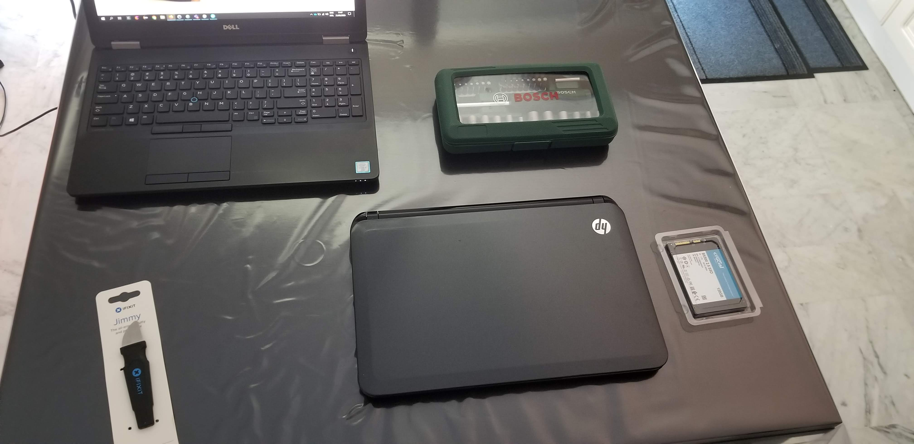

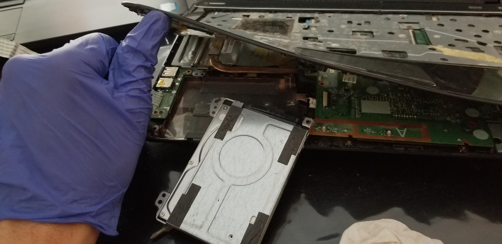

Remove connector keyboard (open connector)

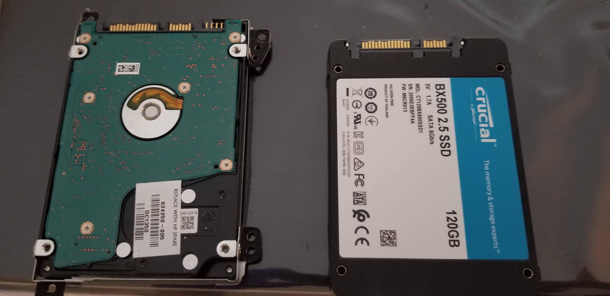

SSD drive is much ligther!

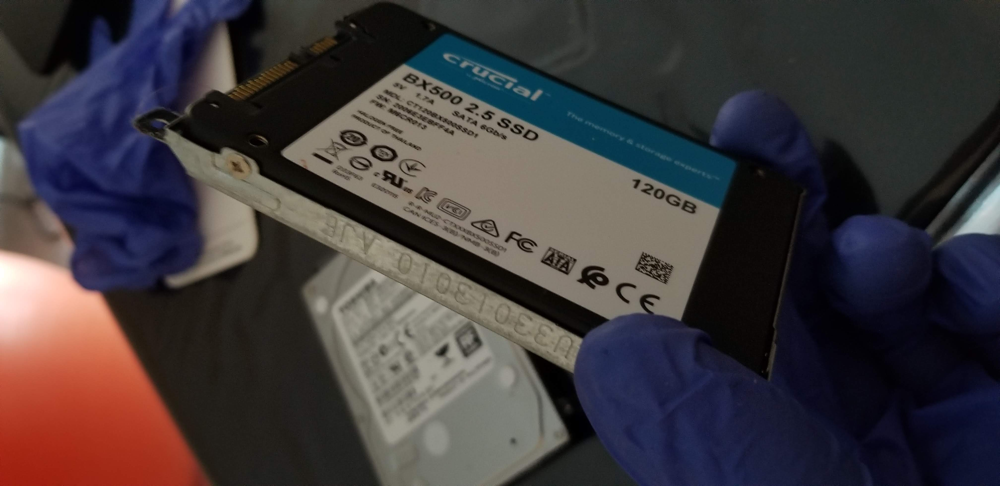

Remove connector moherboard (open connector)

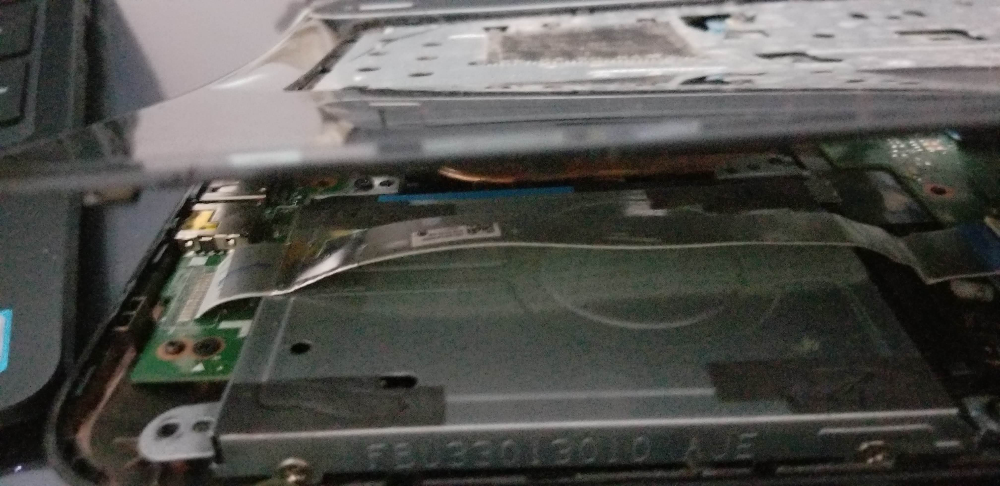

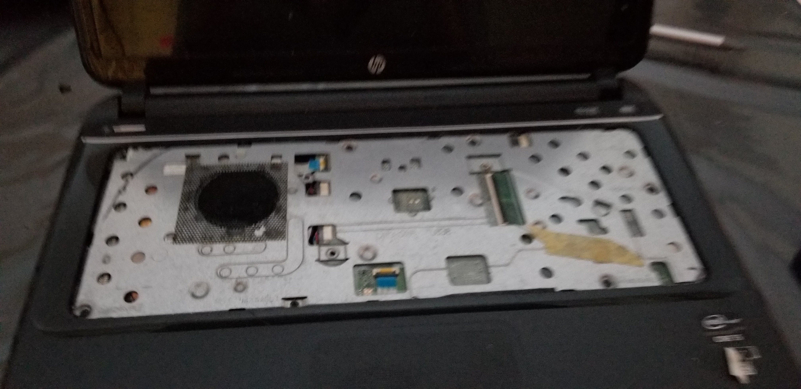

## Make a Ubuntu bootable USB stick

- [Downlaod ubuntu 20.04 LTS](https://ubuntu.com/download/desktop)
- Make USB drive using Rufus as described [here](https://ubuntu.com/tutorials/tutorial-create-a-usb-stick-on-windows?_ga=2.247769986.484999874.1590064086-738814981.1584441798#10-installation-complete)

## Setup OS on the laptop with the new hard drive


Here was my biggest issue.
`ESC`, `F9` for boot device options was selected but ignored.
It is defaulting to a `grub` bash like.
I can not access the BIOS.

### Some hints

I did not find any documentation with a clear solution.

Here is what helped me:

- [Ubuntu doc](https://help.ubuntu.com/community/BootFromUSB)

````buildoutcfg
grub> root (hd1,0)   # second hard drive usually is the USB drive if you have only one internal drive
grub> find /[tab]
 Possible files are: ldlinux.sys mydoc myfile mystick syslinux.cfg  # Bingo, that's the USB stick
chainloader +1
boot
````

On my setup this was not working and probably because I am in `EFI` mode.
I realized that root is not working on my setup and I should use `set root='(hd1,gpt1)` based on this SO [question](https://unix.stackexchange.com/questions/474312/error-hd1-gpt2-not-found).


- [Manjaro Linux Forum](https://forum.manjaro.org/t/detecting-efi-files-and-booting-them-from-grub/38083)

````buildoutcfg
insmod fat
insmod chain
search -f /efi/manjaro/grubx64.efi --set=root
chainloader /efi/manjaro/grubx64.efi
boot
````

We can give tothe chainloader the EFI path.
Combining the 2 leads to this solution proposal.

 
### Solution

#### Magic grub command

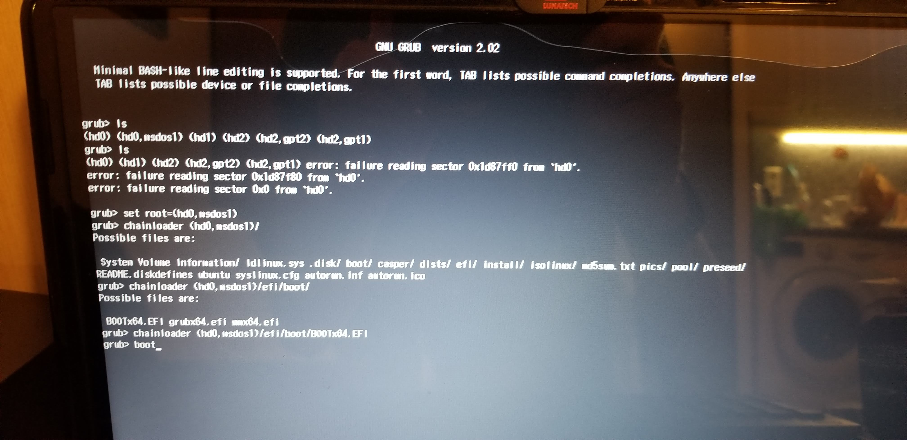

````shell script
# Show all the drive
grub> ls

# Unplug live USB to detect which drive is the Live USB
grub> ls

# This will cause a reading sector error on the drive which is the live USB
# Now we know the live USB is (hd0)
# PLug the USB key
# Doing ls (hd0) leads to unknow file system
# ls (hd0,msdos1)/ show live USB content

grub > set root=(hd0,msdos1) # This is not optional otherwise error

grub > chainloader (hd0,msdos1)/efi/boot/BOOTx64.efi
grub > boot
````

Tips: if you have a qwerty keybaord use it :)

#### Nexts

This will start diagnostic and setup screen. As shown in the video [here](https://photos.app.goo.gl/6EY93UydRE2kGNZd8).

<!---
All medias are copied in this repo except this video,
Checkmedia 6 pic montage/6 pic setup in cloud/phone/here + video in cloud/phone OK, other not SOT (downl, sent)
Video issue when reading in laptop working via logged in google photo app OK
order is respected)
-->

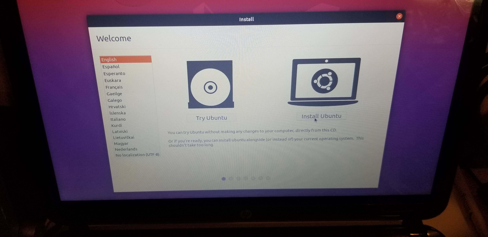

I format all my drive because of the mess by using partition table

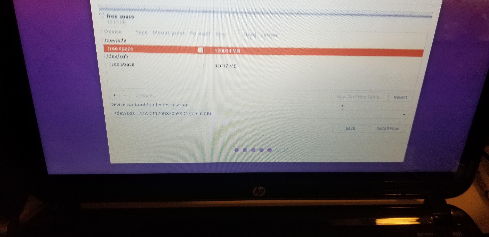

You may have to restart a new setup and repeat command above again


After that, it starts diagnostic (as in the video, it is a second time, OK) and we reach setup screen

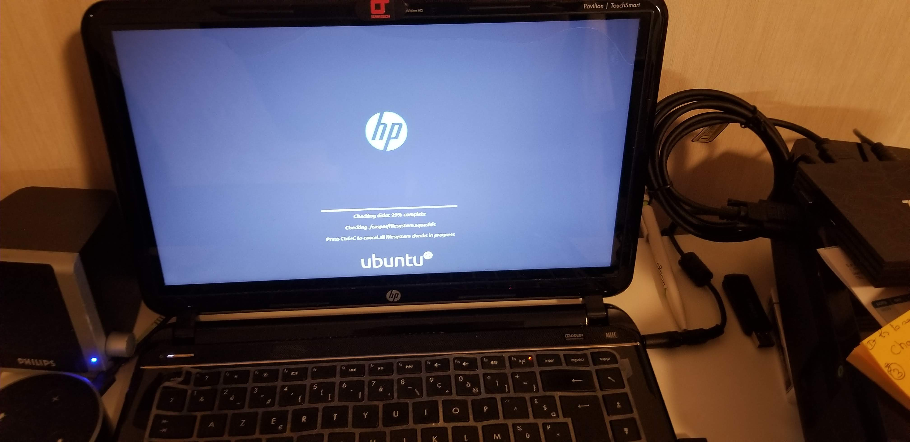

And we setup Ubuntu on the SSD (we can see a 120 gb drive along with a 32gb which was initially used by HP for Windows restore partition)

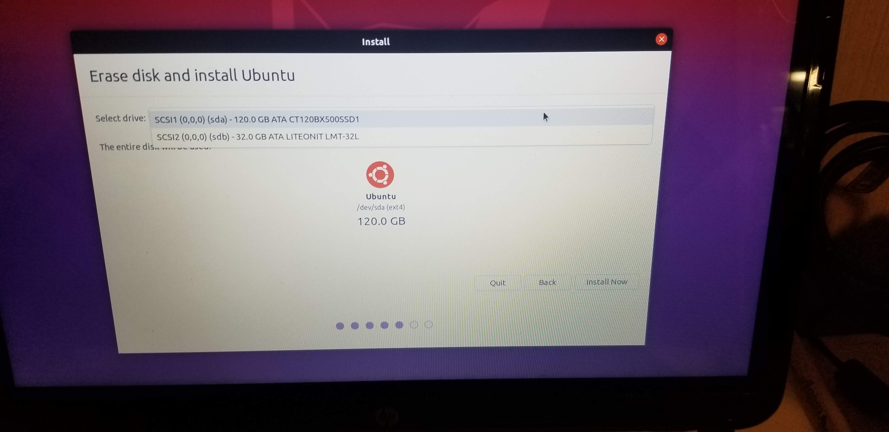


At every startup note HP logo is now present,
 

## Sound issue 

Tested with other jack cable and working.
Order a new one.

## Setup software

- [Minikube](https://github.com/scoulomb/myk8s/blob/master/Setup/MinikubeSetup/BARE_SETUP_README.md)
try other driver?
- [Chrome](https://www.google.fr/chrome/) or  Chromum using using Ubuntu software center (search on top left) - lfd
I will take option 1 install chrome [from deb package](https://unix.stackexchange.com/questions/159094/how-to-install-a-deb-file-by-dpkg-i-or-by-apt):

````
sudo apt install /path/to/package/name.deb
````

- Python 3 already there, type `python3`
- Same for git, but import my [config](https://github.com/scoulomb/dev_vm/blob/custom/saltstack/salt/common/git/gitconfig)

````
# Using custom branch
# Otherwise sed
curl https://raw.githubusercontent.com/scoulomb/dev_vm/custom/saltstack/salt/common/git/gitconfig?token=ABAT3YIIMOW7FXGUXSYDYMC6Y623I >~/.gitconfig 
````

Install diff-so-fancy


````
sudo apt install npm
sudo npm install -g diff-so-fancy
````


