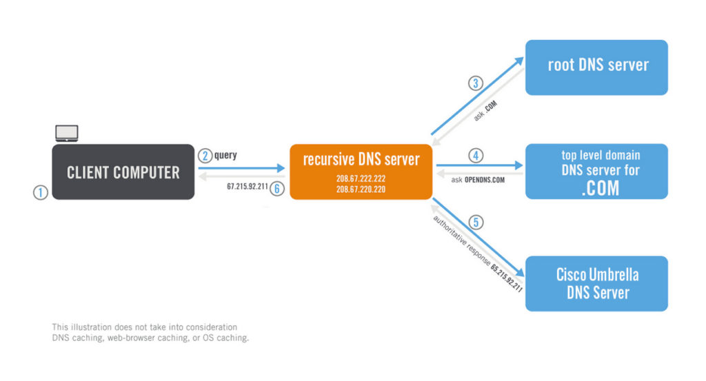

# DNS

Run script in [summary](p2-1-summary-configure-forward-zone.md)

## Note on recursive DNS and authoritative DNS 


### Basic records

In prevous file we had A, AAAA, CNAME, MX records 

````shell script
[root@server1 cloud_user]# nslookup scoulomb.mylabserver.com localhost
Server:         localhost
Address:        ::1#53

Name:   scoulomb.mylabserver.com
Address: 42.42.42.42

[root@server1 cloud_user]# nslookup scoulombipv6.mylabserver.com localhost
Server:         localhost
Address:        ::1#53

Name:   scoulombipv6.mylabserver.com
Address: 2001:db8:85a3:8d3:1319:8a2e:370:7348

[root@server1 cloud_user]# nslookup dns.mylabserver.com localhost
Server:         localhost
Address:        ::1#53

dns.mylabserver.com     canonical name = nameserver.mylabserver.com.
Name:   nameserver.mylabserver.com
Address: 172.31.18.93

[root@server1 cloud_user]# nslookup mylabserver.com localhost
Server:         localhost
Address:        ::1#53

*** Can't find mylabserver.com: No answer

[root@server1 cloud_user]# nslookup -type=MX mylabserver.com localhost
Server:         localhost
Address:        ::1#53

mylabserver.com mail exchanger = 20 mailbackup.mylabserver.com.
mylabserver.com mail exchanger = 10 mailprod.mylabserver.com.
````

- Default type is A and AAAA (cf. [questions](./p2-1-xx-questions.md#Can-I-have-A-and-AAAA-records-with-same-DNS-name?))
- We can also that I had to specify MX for mail exchange.
- For CNAME it was not necessary to apply the type as it applies A type.

Proof: 

````shell script
[root@server1 cloud_user]# nslookup -type=A dns.mylabserver.com localhost
Server:         localhost
Address:        ::1#53

dns.mylabserver.com     canonical name = nameserver.mylabserver.com.
Name:   nameserver.mylabserver.com
Address: 172.31.18.93

[root@server1 cloud_user]# nslookup -type=CNAME dns.mylabserver.com localhost
Server:         localhost
Address:        ::1#53

dns.mylabserver.com     canonical name = nameserver.mylabserver.com.
````
When we specify CNAME type, address is not returned unlike A.

### Special A record

We have to define it

````shell script

[root@server1 cloud_user]# nslookup -type=A mylabserver.com localhost
Server:         localhost
Address:        ::1#53

*** Can't find mylabserver.com: No answer

[root@server1 cloud_user]# nslookup -type=A nameserver.mylabserver.com localhost
Server:         localhost
Address:        ::1#53

Name:   nameserver.mylabserver.com
Address: 172.31.18.93
````

Cf. [questions](./p2-1-xx-questions.md#Can-I-remove-entry-with-same-name-as-the-zone?))


### There are 2 special records ns and soa

- `NS` records are used to redirect DNS resolver to the next DNS server that is hosting the next level zone.
- `SOA` record is used by cluster of DNS servers to sync latest changes from the master to secondary servers.

Source: [Quora: What is the difference between SOA record and NS record?](https://www.quora.com/What-is-the-difference-between-SOA-record-and-NS-record-Does-NS-record-help-the-resolver-to-identify-the-ipaddress-of-domain-without-requesting-the-root-server)

We can retrieve them and map it to zone file in [summary](p2-1-summary-configure-forward-zone.md).

````shell script
[root@server1 cloud_user]# nslookup -type=soa nameserver.mylabserver.com localhost
Server:         localhost
Address:        ::1#53

*** Can't find nameserver.mylabserver.com: No answer

[root@server1 cloud_user]# nslookup -type=soa mylabserver.com localhost
Server:         localhost
Address:        ::1#53

mylabserver.com
        origin = nameserver.mylabserver.com
        mail addr = root.mylabserver.com
        serial = 10030
        refresh = 3600
        retry = 1800
        expire = 604800
        minimum = 86400

[root@server1 cloud_user]# nslookup -type=ns nameserver.mylabserver.com localhost
Server:         localhost
Address:        ::1#53

*** Can't find nameserver.mylabserver.com: No answer

[root@server1 cloud_user]# nslookup -type=ns mylabserver.com localhost
Server:         localhost
Address:        ::1#53

mylabserver.com nameserver = nameserver.mylabserver.com.

````


 
### Recursive DNS and authoritative DNS 



**Source**: https://umbrella.cisco.com/blog/difference-authoritative-recursive-dns-nameservers

#### Recursive

> Once your computer connects to its assigned recursive DNS server (`/etc/resolv.conf` or parameter in nslookup), 
it asks the question “what’s the IP address assigned to that website name?” 
The recursive DNS server doesn’t have a copy of the phone book, but it does know where to find one.
So it connects to another type of DNS server to continue the search.
I am adding it caches the results.

**Source**: https://umbrella.cisco.com/blog/difference-authoritative-recursive-dns-nameservers

#### Authoritative

> The second type of DNS server holds a copy of the regional phone book that matches IP addresses with domain names.
These are called authoritative DNS servers.
Authoritative DNS nameservers are responsible for providing answers to recursive DNS nameservers about where specific websites can be found.
These answers contain important information for each domain, like IP addresses.


**Source**: https://umbrella.cisco.com/blog/difference-authoritative-recursive-dns-nameservers


#### Both 

Same DNS server can be a recursive and authoritative.
For instance our local DNS is recursive as shown in [part 1](./p1-1-dns-cache.md)
But it is authoritative for the domain we defined in the forward zone file cf. [summary](./p2-1-summary-configure-forward-zone.md).

When we target directly (`/etc/resolv.conf` or parameter in nslookup) the DNS which is the authority for a zone (cf. [questions](./p2-1-xx-questions.md#Can-I-override-a-public-entry-in-my-local-DNS)) no recursion is performed.
It is the reason why [part 1](./p1-1-dns-cache.md) or here in [DNS querying](./p2-3-DNS-querying.md#Resolve-the-IP-for-google.com-with-nslookup).
We have `Non-authoritative answer` in response unlike the look up made in at beginning of [file](#Basic-records), where it is the authority.

Btw in the nslookup answer we can see it is authoritative one

```
[root@server1 cloud_user]# nslookup nameserver.mylabserver.com localhost
Server:         localhost
Address:        ::1#53

Name:   nameserver.mylabserver.com
Address: 172.31.18.93


````

Unlike with 

````
[cloud_user@server1 ~]$ nslookup google.fr localhost
;; Got SERVFAIL reply from ::1, trying next server
Server:         localhost
Address:        ::1#53

** server can't find google.fr: NXDOMAIN

[cloud_user@server1 ~]$ nslookup google.fr localhost
Server:         localhost
Address:        ::1#53

Non-authoritative answer:
Name:   google.fr
Address: 142.250.31.94
Name:   google.fr
Address: 2607:f8b0:4004:c0b::5e
````


Same when we override the com zone in [questions](./p2-1-xx-questions.md#Can-I-override-a-public-entry-in-my-local-DNS)
It became authoritative for com zone

For a DNS to not be authoritative, we dot define zone.
There is also no recursion option to disable the recursion.

### We can find which DNS is authoritative with SOA record  


We can find it like this   (cf. https://stackoverflow.com/questions/38021/how-do-i-find-the-authoritative-name-server-for-a-domain-name)

````
sylvain@sylvain-hp:~$ nslookup
> set querytype=soa
> google.com
Server:		127.0.0.53
Address:	127.0.0.53#53

Non-authoritative answer:
google.com
	origin = ns1.google.com
	mail addr = dns-admin.google.com
	serial = 315449991
	refresh = 900
	retry = 900
	expire = 1800
	minimum = 60

Authoritative answers can be found from:

````

(using ISP or 8.8.8.8 DNS example, `nslookup -type=soa google.com 8.8.8.8`)
And we can target it as it is recustive and authoritative for google.com, we have the authoritative answer (no recursion)

````
sylvain@sylvain-hp:~$ nslookup google.com ns1.google.com
Server:		ns1.google.com
Address:	216.239.32.10#53

Name:	google.com
Address: 216.58.204.142
Name:	google.com
Address: 2a00:1450:4007:812::200e

````
Note Non authoritative is not mentioned!


We could have also used `ns` instead of `soa`:

````shell script
[root@server1 cloud_user]# nslookup -type=ns google.com 8.8.8.8
Server:         8.8.8.8
Address:        8.8.8.8#53

Non-authoritative answer:
google.com      nameserver = ns3.google.com.
google.com      nameserver = ns4.google.com.
google.com      nameserver = ns1.google.com.
google.com      nameserver = ns2.google.com.

Authoritative answers can be found from:
````


It shows that similarly (as my localhost DNS), a public DNS can be a recursive DNS (as when using localhost) and has authority role  (SOA) for a given domain,
For instance for google domain (same as mylabserver.com)

### Make my localhost authoritative DNS entry visible through recursion for other DNS

For this I would use the `soa` record we just show [above](#There-are-2-special-records-ns-and-soa).
And this `soa` record would be register in top level domain (`mylabserver.com`).
Where `mylaberver.com` would have another soa registered in `com` domain.
 
See that: https://en.wikipedia.org/wiki/Domain_name_registrar

See all this applied to [Azure DNS](../3-DNS-solution-providers/2-Azure-DNS/azure-autho-rec.md).


