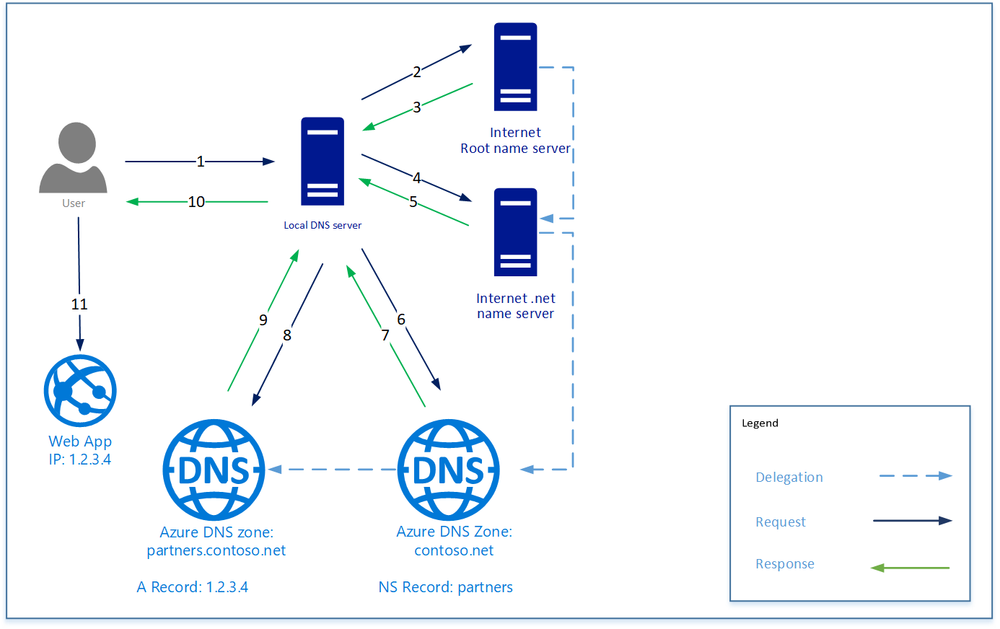

# Azure authoritative and recursive

This is linked to [Note on recursive DNS and authoritative DNS](basic-bind-lxa\p2-1-zz-note-on-recursive-and-authoritative-dns.md).

Azure choice is to provide an authoritative DNS only.

> There are two types of DNS servers:
> An authoritative DNS server hosts DNS zones.
> It answers DNS queries for records in those zones only.

> A recursive DNS server does not host DNS zones. 
> It answers all DNS queries by calling authoritative DNS servers to gather the data it needs.

> Azure DNS provides an authoritative DNS service. 
> It does not provide a recursive DNS service.
> Cloud Services and VMs in Azure are automatically configured to use a recursive DNS service that is provided separately as part of Azure's infrastructure.

The following image shows an example DNS query.
The contoso.net and partners.contoso.net are Azure DNS zones.

.

> 1. The client requests www.partners.contoso.net from their local DNS server.
> 2. The local DNS server does not have the record so it makes a request to their root name server.
> 3. The root name server does not have the record, but knows the address of the .net name server, it provides that address to the DNS server
> 4. The local DNS server sends the request to the .net name server.
> 5. The .net name server does not have the record but does know the address of the contoso.net name server. In this case, it responds with the address of the name server for the DNS zone hosted in Azure DNS.
> 6. The local DNS server sends the request to the name server for the contoso.net zone hosted in Azure DNS.
> 7. The zone contoso.net does not have the record but knows the name server for partners.contoso.net and responds with the address. In this case, it is a DNS zone hosted in Azure DNS.
> 8. The local DNS server sends the request to the name server for the partners.contoso.net zone.
> 9. The partners.contoso.net zone has the A record and responds with the IP address.
> 10. The local DNS server provides the IP address to the client
> 11. The client connects to the website www.partners.contoso.net.

Each delegation actually has two copies of the NS records; one in the parent zone pointing to the child, and another in the child zone itself. 
The 'contoso.net' zone contains the NS records for 'contoso.net' (in addition to the NS records in 'net'). These records are called authoritative NS records and they sit at the apex of the child zone.
